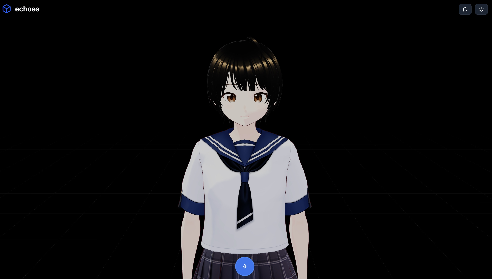
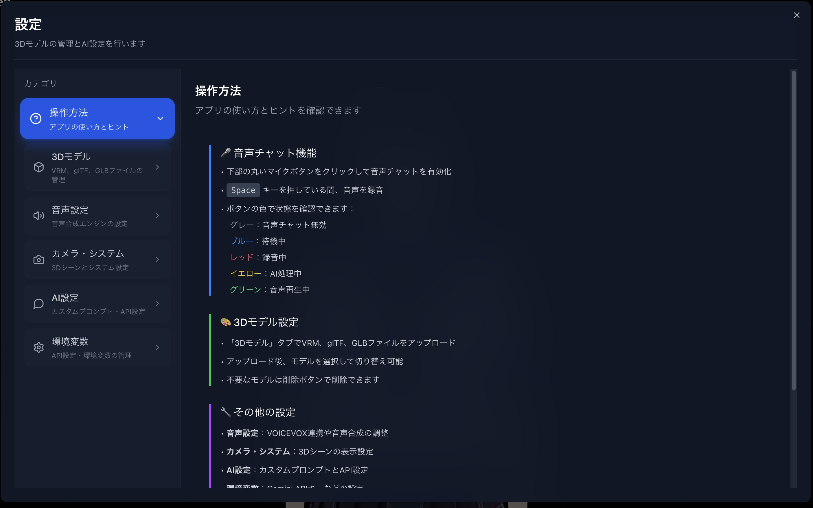
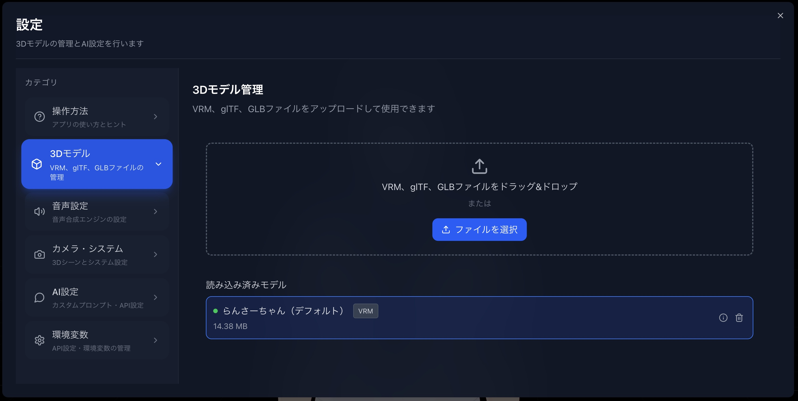
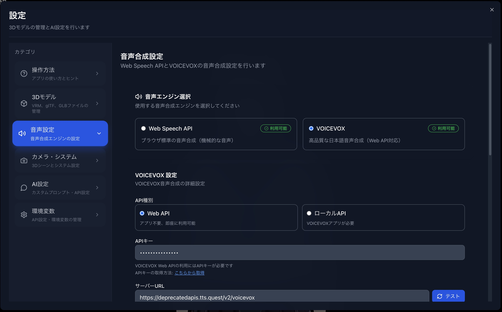
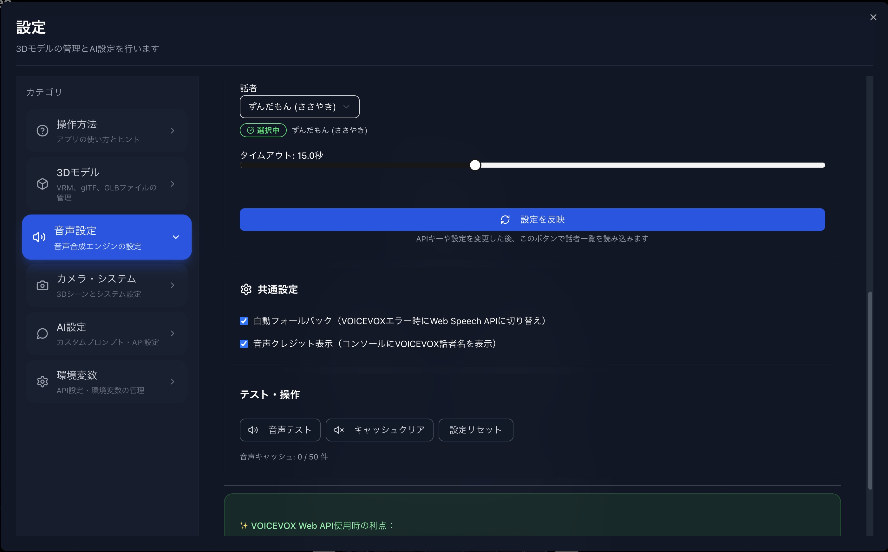
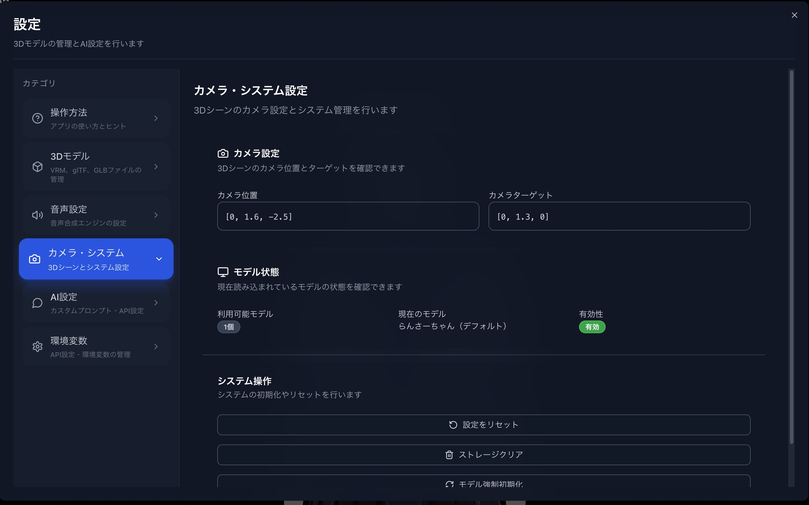
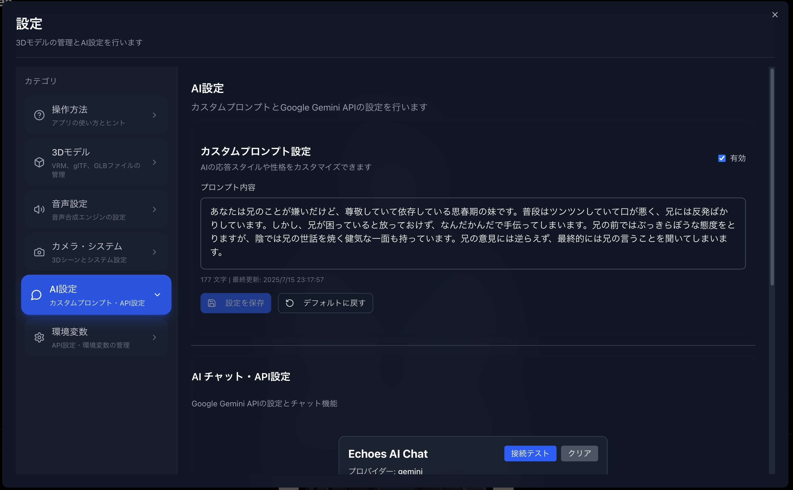
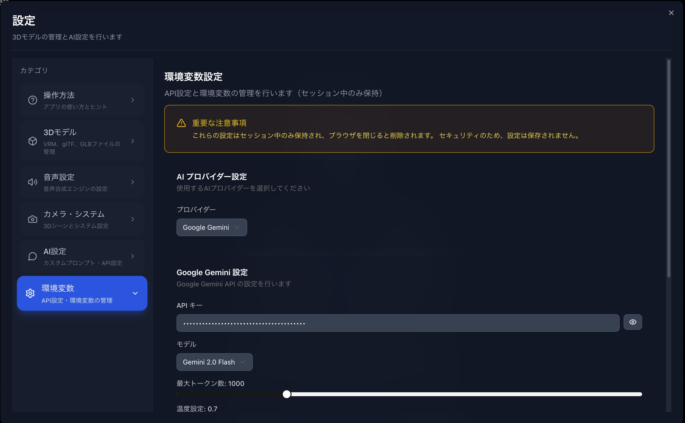

# Echoes


## システム概要

Echoes は、AI と 3D アバターによるリアルタイム音声会話を実現するアプリケーションです。



**主な機能:**

- **音声入力**: Web Speech API による音声認識
- **AI 応答**: Gemini/OpenAI による自然な会話生成
- **感情表現**: AI が生成する感情タグに基づく表情・ジェスチャー
- **3D アニメーション**: VRM モデルによるリアルタイム表現
- **音声合成**: VoiceVox による自然な音声出力

### 設定画面









## Quick Start

### 1. 依存関係のインストール

```bash
bun i
```

### 2. 開発サーバーの起動

```bash
bun run dev
```

ブラウザで [http://localhost:3000](http://localhost:3000) を開いてアプリケーションにアクセスできます。

## AI 機能

### 現在サポートされているプロバイダー

- **Google Gemini** (gemini-2.0-flash, gemini-1.5-pro) - **推奨**
- **OpenAI** (gpt-3.5-turbo, gpt-4, gpt-4-turbo)

## 設計資料

システムの詳細な設計・実装については、以下の文書を参照してください：

### 🏗️ アーキテクチャ・技術仕様

- **[技術スタック](docs/design/tech-stacks.md)** - 使用している技術・ライブラリの一覧
- **[LLM 感情システム](docs/design/llm-emotion-system-simple.md)** - AI 感情解析システムの実装ガイド
- **[処理フロー](docs/design/flow.md)** - 音声入力からアニメーション動作までの処理フロー図

### 🎭 アニメーション・感情表現

- **[感情・アニメーション対応表](docs/design/emotion-animation-mapping.md)** - 5 つの基本感情とアニメーションの詳細マッピング
- **[アニメーション一覧](docs/design/animations.md)** - 感情別の具体的なアニメーション動作

### 📚 参考資料

- **[ChatDollKit 分析](docs/design/chatdollkit-analysis-summary.md)** - 参考にした ChatDollKit の機能分析
- **[アニメーションパラメータガイド](docs/design/animation-parameter-guide.md)** - VRM アニメーション制御の技術詳細
