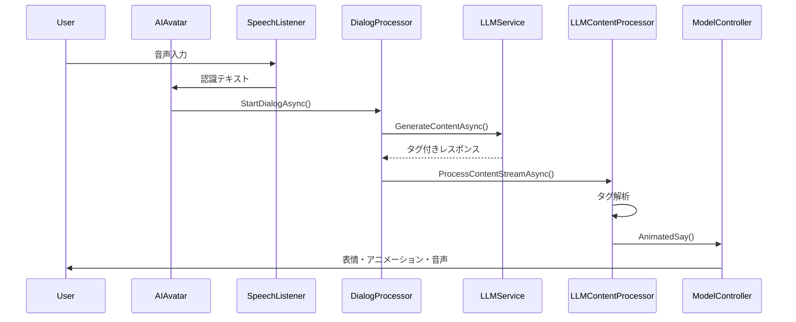

# ChatdollKit 感情分析システム 総合分析レポート

## プロジェクト概要

**プロジェクト名**: uezo/ChatdollKit
**分析対象**: Unity ベース 3D アバター対話システム
**特徴**: LLM 駆動型感情表現システム

ChatdollKit は、Unity 上で AI の 3D アバターと自然な対話を実現するフレームワークです。従来の感情検出とは異なる革新的な LLM 駆動型のアプローチを採用しています。

## 感情システムの革新的アプローチ

### LLM 駆動型感情タグシステム

**従来の感情検出との違い**:

- **従来**: ユーザー入力から感情を検出 → 反応決定
- **ChatdollKit**: LLM が文脈に応じて感情タグを生成 → 表現実行

**実装方式**:

```csharp
// LLMレスポンス例
"[face:Joy]こんにちは！[anim:waving_arm]元気ですか？"
```

**対応感情**:

- `Neutral` - 中立
- `Joy` - 喜び
- `Angry` - 怒り
- `Sorrow` - 悲しみ
- `Fun` - 楽しさ
- `Surprise` - 驚き

### システムプロンプト設定例

```md
あなたは以下の表情を持っています: 'Joy', 'Angry', 'Sorrow', 'Fun', 'Surprised'
特定の感情を表現したい場合は、文章の最初に[face:Joy]のように挿入してください。

例:
[face:Joy]やった、海が見える！[face:Fun]泳ぎに行こう。
```

## Unity 技術スタック

### コア コンポーネント

**AIAvatar**:

- 中央制御コンポーネント
- 状態管理（Idle, Sleep, Conversation）
- ウェイクワード検出

**ModelController**:

- 3D アバター制御の中核
- アニメーション・表情・音声の統合管理
- Unity Animator との連携

**DialogProcessor**:

- 対話フロー管理
- LLM サービスとの通信
- レスポンス生成制御

**LLMContentProcessor**:

- LLM レスポンスの解析
- タグ抽出（`[face:]`, `[anim:]`）
- AnimatedVoiceRequest 生成

### Unity 固有機能の活用

**アニメーション制御**:

```csharp
// Animator Component 使用
animator.CrossFade(animationState, fadeTime);

// アイドルアニメーション
modelController.AddIdleAnimation("idle_01", weight: 1.0f);
```

**表情制御**:

```csharp
// SkinnedMeshRenderer でブレンドシェイプ制御
IFaceExpressionProxy.SetExpression("Joy", intensity);
```

**音声合成**:

```csharp
// AudioSource + uLipSync
AudioClip speechClip = speechSynthesizer.Synthesize(text);
lipSyncHelper.RequestLipSync(speechClip);
```

## システムアーキテクチャ

### 対話フロー



### コンポーネント連携

**主要インターフェース**:

- `ILLMService` - LLM サービス抽象化
- `IFaceExpressionProxy` - 表情制御抽象化
- `IBlink` - まばたき制御
- `ILipSyncHelper` - リップシンク制御

## 技術的特徴と利点

### LLM 駆動型の利点

1. **文脈理解**:

   - 会話全体の流れを理解した感情表現
   - 単語単位ではなく文脈に基づく判断

2. **柔軟性**:

   - システムプロンプト変更だけで感情表現を調整
   - 新しい感情・アニメーションの追加が容易

3. **自然性**:
   - AI が自発的に適切な感情を選択
   - 人間らしい表現の多様性

### Unity 統合の利点

1. **リアルタイム性**:

   - 60FPS でのスムーズなアニメーション
   - 音声とリップシンクの同期

2. **拡張性**:

   - VRM モデル対応
   - カスタムアニメーション追加

3. **パフォーマンス**:
   - Unity の最適化機能活用
   - VoicePrefetchMode による効率化

## AITuber Kit との比較

| 項目                 | AITuber Kit        | ChatdollKit     |
| -------------------- | ------------------ | --------------- |
| **プラットフォーム** | Web (Next.js)      | Unity           |
| **感情検出**         | 正規表現タグ抽出   | LLM 生成タグ    |
| **3D モデル**        | Live2D, VRM        | VRM 中心        |
| **制御方式**         | 静的タグマッピング | 動的 LLM 判断   |
| **拡張性**           | 設定ファイル       | Unity Inspector |
| **リアルタイム性**   | Web 制約あり       | Unity 最適化    |

## 現プロジェクトへの応用可能性

### 1. LLM 駆動型感情システムの導入

**実装案**:

```typescript
// src/lib/emotion/llm-emotion-detector.ts
export class LLMEmotionDetector {
  async generateEmotionalResponse(
    userInput: string,
    context: ConversationContext
  ): Promise<EmotionalResponse> {
    const prompt = this.buildEmotionPrompt(userInput, context);
    const llmResponse = await this.llmService.generate(prompt);
    return this.parseEmotionTags(llmResponse);
  }
}
```

### 2. 3D アバター制御システム

**Three.js/React Three Fiber 実装**:

```typescript
// src/components/avatar/EmotionalAvatar.tsx
export const EmotionalAvatar = ({ emotion, animation }: Props) => {
  const { scene } = useGLTF("/models/avatar.vrm");

  useEffect(() => {
    if (emotion) {
      applyFacialExpression(scene, emotion);
    }
    if (animation) {
      playAnimation(scene, animation);
    }
  }, [emotion, animation, scene]);
};
```

### 3. システムプロンプト管理

**設定管理**:

```typescript
// src/lib/config/emotion-prompts.ts
export const EMOTION_SYSTEM_PROMPTS = {
  basic: `あなたは以下の感情を表現できます: [neutral], [happy], [sad], [angry], [surprised]
  適切な場面で感情タグを使用してください。`,

  advanced: `文脈に応じて自然な感情表現を心がけ、
  会話の流れに合わせて適切なタグを選択してください。`,
};
```

## 学習ポイントと今後の展開

### 技術的学習事項

1. **LLM 統合パターン**:

   - システムプロンプトによる行動制御
   - タグベースの構造化出力

2. **Unity 最適化手法**:

   - Animator Controller の効率的利用
   - ブレンドシェイプによる表情制御

3. **リアルタイム同期**:
   - 音声・表情・アニメーションの統合

### 応用可能技術

1. **マルチモーダル対応**:

   - テキスト + 音声 + 視覚情報の統合
   - より豊かな感情表現

2. **パーソナライゼーション**:

   - ユーザー固有の感情パターン学習
   - 個別最適化されたアバター反応

3. **リアルタイム感情分析**:
   - ユーザーの感情状態検出
   - 双方向感情インタラクション

## 結論

ChatdollKit は、LLM 駆動型感情表現という革新的なアプローチを採用し、従来の感情検出システムを超えた自然で文脈的な感情表現を実現しています。Unity の強力な 3D 機能と組み合わせることで、高品質なリアルタイム 3D アバター対話システムを構築しています。

この技術は、現在の Web ベースプロジェクトにも応用可能であり、特に LLM を活用した動的感情生成システムは、より自然で人間らしい AI 対話体験の実現に大きく貢献できると考えられます。
