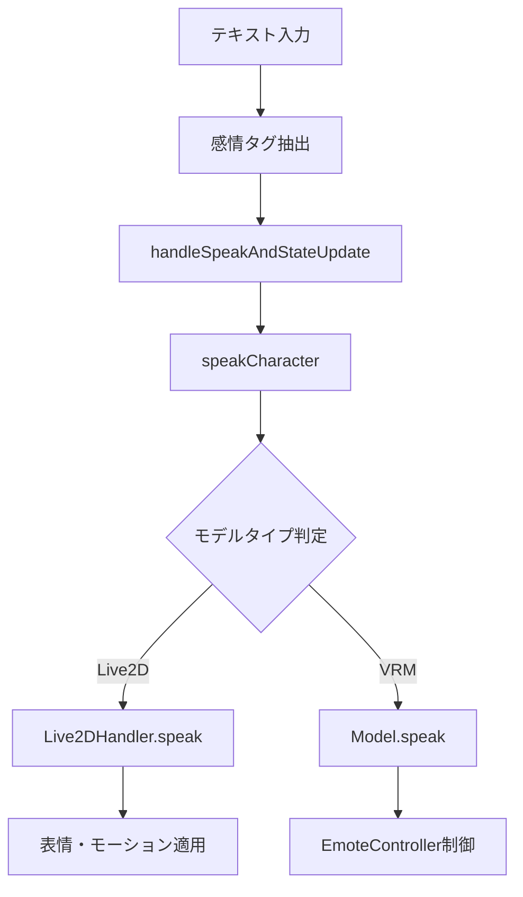

# AITuber Kit 感情分析システム 総合分析レポート

## プロジェクト概要

**プロジェクト名**: tegnike/aituber-kit
**分析対象**: 感情検出・表現システム

AITuber Kit は、Web 上で AI の 3D モデル（Live2D・VRM）と対話できるシステムです。本レポートでは、特に感情がどのように処理され、3D モデルに表現されるかを詳細に分析しました。

## 感情検出システム

### 実装方式

- **ファイル**: `src/features/chat/handlers.ts`
- **関数**: `extractEmotion`
- **方式**: 正規表現による感情タグ抽出

```typescript
// テキストから [感情名] 形式のタグを抽出
const emotionMatch = text.match(/\[(.+?)\]/);
```

### 対応感情一覧

1. **neutral** - 通常・中立
2. **happy** - 嬉しい・喜び
3. **angry** - 怒り
4. **sad** - 悲しい
5. **relaxed** - リラックス
6. **surprised** - 驚き

## 3D モデル表現システム

### Live2D モデル制御

**実装ファイル**: `src/features/live2d/live2dHandler.ts`

**特徴**:

- 各感情に対応する表情リスト（例：`happyEmotions`）
- モーショングループ（例：`happyMotionGroup`）
- ランダム選択による自然な表現

**制御フロー**:

```markdown
Live2DHandler.speak() → 感情判定 → 表情設定 → モーション設定
```

### VRM モデル制御

**実装ファイル**: `src/components/model.tsx`

**特徴**:

- `EmoteController`による表情制御
- VRM の表情プリセット名を使用
- よりシンプルな実装

**制御フロー**:

```markdown
Model.speak() → emoteController.playEmotion(emotion)
```

## システム処理フロー



## 技術スタック

### コア技術

- **TypeScript** - 全体のコードベース
- **Zustand** - 状態管理
- **正規表現** - 感情タグ抽出

### 3D モデル制御

- **Live2D Cubism SDK** - Live2D モデル制御
- **@pixiv/three-vrm** - VRM モデル制御
- **Web Audio API** - 音声処理

## 設定管理システム

### 設定ファイル

- **メイン**: `src/features/stores/settings.ts`
- **UI 設定**: `src/components/settings/character.tsx`

### カスタマイズ機能

- 各感情の表情設定
- モーション設定
- 多言語対応（日本語、英語、フランス語、ポーランド語、韓国語、ロシア語）

## Live2D vs VRM 比較

| 項目               | Live2D                           | VRM                      |
| ------------------ | -------------------------------- | ------------------------ |
| **制御の詳細度**   | 高（詳細な表情・モーション設定） | 中（表情プリセット中心） |
| **実装複雑度**     | 高（Live2DHandler クラス）       | 低（EmoteController）    |
| **カスタマイズ性** | 高                               | 中                       |
| **パフォーマンス** | 最適化済み                       | 軽量                     |

## システムの特徴

### 長所

1. **シンプルな感情検出** - 正規表現ベースで理解しやすい
2. **両モデル対応** - Live2D と VRM の両方をサポート
3. **カスタマイズ性** - UI 経由での設定変更が可能
4. **多言語対応** - 国際的な利用に対応

### 改善可能な点

1. **感情検出の高度化** - AI/ML ベースの感情分析導入
2. **感情種類の拡張** - より細かい感情表現
3. **感情の強度** - 感情の強弱表現

## 今後の活用可能性

### 学習ポイント

1. **3D モデル制御パターン** - ハンドラークラスによる抽象化
2. **感情システム設計** - タグベース感情検出の実装
3. **状態管理** - Zustand を使った設定管理
4. **多言語対応** - i18n 実装パターン

### 応用可能な技術

- 感情タグ抽出ロジック
- 3D モデル制御アーキテクチャ
- 設定管理システム
- 多言語対応システム

## まとめ

AITuber Kit は、シンプルながら効果的な感情分析・表現システムを実装しています。正規表現ベースの感情検出とモデル別の表現制御により、実用的な AI 対話システムを構築している点が特徴的です。

特に、Live2D と VRM の両方に対応した柔軟なアーキテクチャは、今後の 3D キャラクター制御システム開発において参考になる優れた設計と言えます。

---

**分析者**: AI Assistant
**参考リポジトリ**: [https://github.com/tegnike/aituber-kit](https://github.com/tegnike/aituber-kit)
