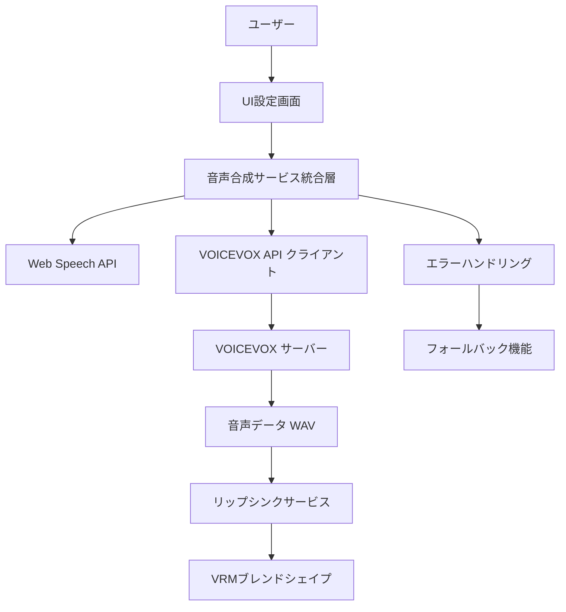

# VOICEVOX音声合成エンジン導入 技術設計書

## 1. 概要

### 1.1 目的
現在のWeb Speech APIによる機械的な音声出力を、VOICEVOX音声合成エンジンによる高品質で自然な日本語音声に置き換える。

### 1.2 背景
- **現状**: Web Speech API（機械的音声）
- **課題**: 音声品質が低く、自然性に欠ける
- **目標**: VOICEVOX（高品質・自然な日本語音声）
- **参考**: AITuberKit実装方式

### 1.3 技術要件
- Web Speech APIとの併用・切り替え可能
- 既存リップシンク機能との連動
- 設定UIでの音声エンジン選択
- エラーハンドリング・フォールバック機能

## 2. VOICEVOX API 仕様調査

### 2.1 基本情報
- **ポート**: `http://localhost:50021` (VOICEVOX), `http://localhost:50121` (VOICEVOX NEMO)
- **API形式**: REST API
- **音声形式**: WAV
- **対応言語**: 日本語特化

### 2.2 主要エンドポイント

#### 2.2.1 話者情報取得
```http
GET /speakers
```
- 利用可能な話者（キャラクター）一覧を取得
- 各話者のID、名前、スタイル情報を含む

#### 2.2.2 音声合成クエリ作成
```http
POST /audio_query?speaker={speaker_id}&text={text}
```
- テキストから音声合成用クエリを生成
- イントネーション、ピッチ、速度等の調整パラメータを含む

#### 2.2.3 音声合成実行
```http
POST /synthesis?speaker={speaker_id}
Content-Type: application/json
Body: {audio_query_result}
```
- クエリから実際の音声データ（WAV）を生成

#### 2.2.4 サーバー状態確認
```http
GET /version
```
- VOICEVOXサーバーの動作確認用

### 2.3 話者ID一覧（参考）
```json
{
  "四国めたん": {"normal": 2, "sweet": 0, "tsun": 6, "sexy": 4},
  "ずんだもん": {"normal": 3, "sweet": 1, "tsun": 7, "sexy": 5},
  "春日部つむぎ": {"normal": 8},
  "雨晴はう": {"normal": 10},
  "波音リツ": {"normal": 9},
  "玄野武宏": {"normal": 11},
  "白上虎太郎": {"normal": 12},
  "青山龍星": {"normal": 13},
  "冥鳴ひまり": {"normal": 14},
  "九州そら": {"normal": 16, "sweet": 15, "tsun": 18, "sexy": 17, "whisper": 19},
  "もち子さん": {"normal": 20},
  "剣崎雌雄": {"normal": 21}
}
```

## 3. システム設計

### 3.1 アーキテクチャ概要



### 3.2 クラス設計

#### 3.2.1 VoicevoxService
```typescript
export class VoicevoxService {
  private baseUrl: string;
  private currentSpeaker: number;
  private isServerAvailable: boolean;
  
  // 基本機能
  async checkServerStatus(): Promise<boolean>
  async getSpeakers(): Promise<VoicevoxSpeaker[]>
  async synthesizeVoice(text: string, speakerId: number): Promise<Blob>
  
  // 内部処理
  private async createAudioQuery(text: string, speakerId: number): Promise<AudioQuery>
  private async synthesizeFromQuery(query: AudioQuery, speakerId: number): Promise<Blob>
}
```

#### 3.2.2 統合音声合成サービス
```typescript
export class IntegratedSpeechService {
  private webSpeechService: SpeechSynthesisService;
  private voicevoxService: VoicevoxService;
  private currentEngine: 'webspeech' | 'voicevox';
  
  async speak(text: string): Promise<boolean>
  switchEngine(engine: 'webspeech' | 'voicevox'): void
  async testEngineAvailability(): Promise<EngineStatus>
}
```

#### 3.2.3 設定管理
```typescript
interface VoiceSynthesisSettings {
  engine: 'webspeech' | 'voicevox';
  voicevox: {
    serverUrl: string;
    speaker: number;
    autoFallback: boolean;
  };
  webspeech: {
    voice: string;
    rate: number;
    pitch: number;
  };
}
```

### 3.3 データフロー

#### 3.3.1 音声合成処理フロー
```
1. ユーザー発話 → AI応答生成
2. 設定確認（VOICEVOX or Web Speech API）
3. VOICEVOX選択時:
   a. サーバー状態確認
   b. テキスト → AudioQuery変換
   c. AudioQuery → WAV音声生成
   d. 音声再生 + リップシンク開始
4. エラー時: Web Speech APIにフォールバック
```

#### 3.3.2 リップシンク連動フロー
```
1. VOICEVOX音声データ（WAV）取得
2. HTMLAudioElement作成・再生
3. 既存リップシンクサービスに音声要素を渡す
4. 音量解析 → ブレンドシェイプ更新
```

## 4. 実装計画

### 4.1 Phase 1: 調査・設計（完了）
- [x] AITuberKit実装調査
- [x] VOICEVOX API仕様調査  
- [x] 技術設計書作成
- [x] 実装計画策定

### 4.2 Phase 2: 基盤実装
#### 4.2.1 VOICEVOX APIクライアント実装
- [ ] `src/lib/services/voicevox-service.ts` 作成
- [ ] サーバー状態確認機能
- [ ] 話者情報取得機能
- [ ] 音声合成機能（AudioQuery → WAV）
- [ ] エラーハンドリング

#### 4.2.2 統合音声合成サービス
- [ ] `src/lib/services/integrated-speech-service.ts` 作成
- [ ] Web Speech API + VOICEVOX 統合
- [ ] エンジン切り替え機能
- [ ] フォールバック機能

#### 4.2.3 設定管理拡張
- [ ] `src/lib/stores/voice-settings-store.ts` 作成
- [ ] VOICEVOX設定項目追加
- [ ] 設定永続化機能

### 4.3 Phase 3: UI実装
#### 4.3.1 設定画面拡張
- [ ] `src/components/settings/voice-settings.tsx` 作成
- [ ] 音声エンジン選択UI
- [ ] VOICEVOX話者選択UI
- [ ] サーバー接続テストUI

#### 4.3.2 既存設定画面統合
- [ ] `src/components/settings/settings-modal.tsx` 更新
- [ ] 「音声設定」タブ追加

### 4.4 Phase 4: 統合・テスト
#### 4.4.1 既存システム統合
- [ ] `src/lib/services/speech-synthesis.ts` 更新
- [ ] `src/lib/services/lipsync-service.ts` 対応
- [ ] `src/components/chat/integrated-emotion-chat.tsx` 更新

#### 4.4.2 テスト・デバッグ
- [ ] 単体テスト作成
- [ ] 統合テスト実行
- [ ] エラーケーステスト
- [ ] パフォーマンステスト

## 5. 技術的課題と対策

### 5.1 主要課題

#### 5.1.1 VOICEVOXサーバー依存
**課題**: ローカルサーバーが必要
**対策**: 
- サーバー状態の定期確認
- 自動フォールバック機能
- ユーザーへの適切な状況通知

#### 5.1.2 音声品質・レイテンシ
**課題**: API通信による遅延
**対策**:
- 音声データのキャッシュ機能
- プリロード機能（よく使う応答）
- 進行状況表示

#### 5.1.3 リップシンク連動
**課題**: WAV音声データとの同期
**対策**:
- 既存のHTMLAudioElement対応を活用
- 音声解析サービスの再利用
- タイミング調整機能

### 5.2 エラーハンドリング戦略

#### 5.2.1 接続エラー
```typescript
try {
  const audioData = await voicevoxService.synthesizeVoice(text, speakerId);
  return await this.playVoicevoxAudio(audioData);
} catch (error) {
  console.warn('VOICEVOX接続エラー、Web Speech APIにフォールバック:', error);
  return await this.webSpeechService.speak(text);
}
```

#### 5.2.2 サーバー未起動
```typescript
const isAvailable = await voicevoxService.checkServerStatus();
if (!isAvailable) {
  this.showNotification('VOICEVOXサーバーが起動していません。Web Speech APIを使用します。');
  return await this.webSpeechService.speak(text);
}
```

## 6. パフォーマンス考慮事項

### 6.1 最適化戦略
- **音声キャッシュ**: 同じテキストの再合成を避ける
- **プリロード**: 定型応答の事前生成
- **並列処理**: 音声生成とリップシンク準備の並行実行

### 6.2 メモリ管理
- WAV音声データの適切な解放
- キャッシュサイズの制限
- 不要な音声データのガベージコレクション

## 7. セキュリティ・プライバシー

### 7.1 ローカル処理の利点
- 音声データがローカルで処理される
- 外部サービスへのデータ送信なし
- プライバシー保護

### 7.2 注意点
- VOICEVOXサーバーのセキュリティ設定
- localhost以外からのアクセス制御

## 8. 利用規約・ライセンス対応

### 8.1 VOICEVOX利用規約
- 各話者の個別利用規約を確認
- クレジット表記の実装
- 商用利用時の制限事項

### 8.2 実装対応
```typescript
const SPEAKER_CREDITS = {
  2: "VOICEVOX:四国めたん",
  3: "VOICEVOX:ずんだもん", 
  8: "VOICEVOX:春日部つむぎ",
  // ... 他の話者
};

function getRequiredCredit(speakerId: number): string {
  return SPEAKER_CREDITS[speakerId] || "VOICEVOX";
}
```

## 9. 将来拡張

### 9.1 追加音声エンジン対応
- Style-Bert-VITS2
- AivisSpeech  
- ElevenLabs
- Azure Speech Services

### 9.2 高度な機能
- 感情表現の音声への反映
- 話速・ピッチの動的調整
- 複数話者の会話対応

## 10. 開発スケジュール

### 10.1 マイルストーン
- **Week 1**: Phase 2.1 VOICEVOX APIクライアント
- **Week 2**: Phase 2.2-2.3 統合サービス・設定管理
- **Week 3**: Phase 3 UI実装
- **Week 4**: Phase 4 統合・テスト・デバッグ

### 10.2 成功指標
- [ ] VOICEVOX音声での正常な音声合成
- [ ] Web Speech APIとの切り替え機能
- [ ] リップシンク正常動作
- [ ] エラー時の適切なフォールバック
- [ ] 設定画面での操作性

## 11. 参考資料

### 11.1 技術資料
- [VOICEVOX公式サイト](https://voicevox.hiroshiba.jp/)
- [VOICEVOX API仕様](http://localhost:50021/docs)
- [AITuberKit実装](https://github.com/tegnike/aituber-kit)

### 11.2 実装参考
- [Python VOICEVOX実装例](https://zenn.dev/zenn24yykiitos/articles/fff3c954ddf42c)
- [React VOICEVOX実装例](https://qiita.com/A_T_B/items/1531d78944d8b796b9fa)

---

**作成日**: 2025年1月12日  
**作成者**: AI Assistant  
**バージョン**: 1.0  
**関連Issue**: #51 