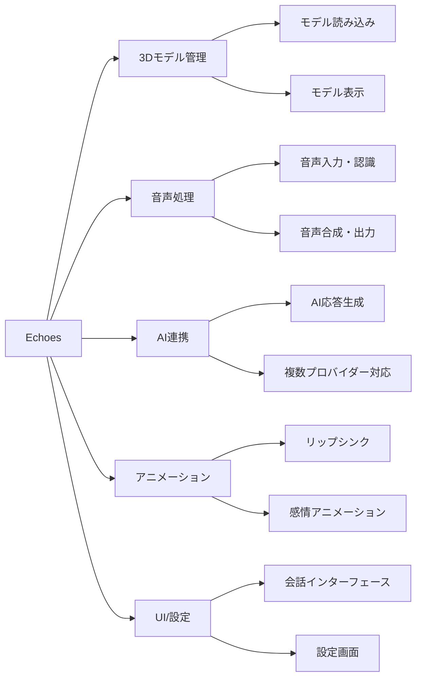

# Echoes 要件定義書

## 1. プロジェクト概要

### 1.1. プロジェクト名

Echoes（エコーズ）

### 1.2. プロジェクトの目的・背景

- **目的**: ユーザーが持ち込んだ 3D モデル（アバター）と、AI を介してリアルタイムに音声で会話できるアプリケーションの開発
- **背景**: AI 技術の普及により、よりインタラクティブで親しみやすい AI 体験の需要が高まっている

## 2. 主要機能

### 2.1. 機能概要

### 2.2. 基本機能一覧

| 機能分類           | 機能名               | 説明                | 実装状況 |
| ------------------ | -------------------- | ------------------- | -------- |
| **3D モデル**      | モデル読み込み       | VRM/glTF/GLB 対応   | ✅ 完了  |
| **3D モデル**      | モデル表示・操作     | 3D 表示、カメラ操作 | ✅ 完了  |
| **音声処理**       | 音声入力・認識       | マイク入力、STT     | ✅ 完了  |
| **音声処理**       | 音声合成・出力       | TTS、音声再生       | ✅ 完了  |
| **AI 連携**        | AI 応答生成          | OpenAI/Gemini API   | ✅ 完了  |
| **AI 連携**        | プロバイダー切り替え | 複数 AI 対応        | ✅ 完了  |
| **アニメーション** | リップシンク         | 音声同期口パク      | ✅ 完了  |
| **アニメーション** | 感情アニメーション   | 5 種類の感情表現    | ✅ 完了  |
| **アニメーション** | ジェスチャー         | 手・頭・体の動き    | ✅ 完了  |
| **UI**             | 会話インターフェース | チャット画面        | ✅ 完了  |
| **UI**             | 設定画面             | 各種設定管理        | ✅ 完了  |
