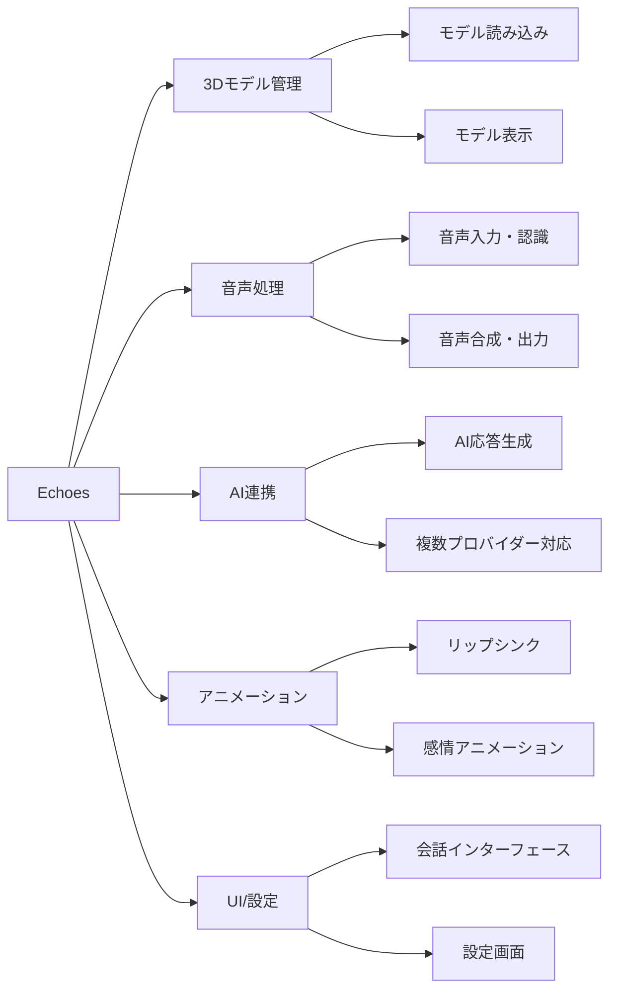

# Echoes 要件定義書

## 1. プロジェクト概要

### 1.1. プロジェクト名

**Echoes（エコーズ）**

### 1.2. プロジェクトの目的・背景

- **目的**: ユーザーが持ち込んだ 3D モデル（アバター）と、AI を介してリアルタイムに音声で会話できるアプリケーションの開発
- **背景**: AI 技術の普及により、よりインタラクティブで親しみやすい AI 体験の需要が高まっている
- **ターゲットユーザー**:
  - VTuber・配信者
  - AI 技術に興味のある一般ユーザー
  - 3D モデル愛好家

### 1.3. プロジェクトスコープ

- **対象プラットフォーム**: Web → デスクトップ → モバイル（段階的展開）
- **開発期間**: 約 7-9 ヶ月
- **開発チーム規模**: 1-3 名想定

## 2. 主要機能

### 2.1. 機能概要

### 2.2. 基本機能一覧

| 機能分類           | 機能名               | 説明                | 実装状況 |
| ------------------ | -------------------- | ------------------- | -------- |
| **3D モデル**      | モデル読み込み       | VRM/glTF/GLB 対応   | ✅ 完了  |
| **3D モデル**      | モデル表示・操作     | 3D 表示、カメラ操作 | ✅ 完了  |
| **音声処理**       | 音声入力・認識       | マイク入力、STT     | ✅ 完了  |
| **音声処理**       | 音声合成・出力       | TTS、音声再生       | ✅ 完了  |
| **AI 連携**        | AI 応答生成          | OpenAI/Gemini API   | ✅ 完了  |
| **AI 連携**        | プロバイダー切り替え | 複数 AI 対応        | ✅ 完了  |
| **アニメーション** | リップシンク         | 音声同期口パク      | ✅ 完了  |
| **アニメーション** | 感情アニメーション   | 5 種類の感情表現    | ✅ 完了  |
| **アニメーション** | ジェスチャー         | 手・頭・体の動き    | ✅ 完了  |
| **UI**             | 会話インターフェース | チャット画面        | ✅ 完了  |
| **UI**             | 設定画面             | 各種設定管理        | ✅ 完了  |

## 3. 技術スタック

### 3.1. フロントエンド

- **React** + **Next.js** + **TypeScript**
- **Three.js** + **React Three Fiber** (3D レンダリング)
- **@pixiv/three-vrm** (VRM モデル対応)
- **Tailwind CSS** + **Shadcn/ui** (スタイリング)
- **Zustand** (状態管理)

### 3.2. 外部サービス・API

- **OpenAI API** (AI 応答生成、音声認識・合成)
- **Google Gemini API** (AI 応答生成)
- **Web Speech API** (音声認識・合成)

### 3.3. 開発ツール

- **ESLint** + **Prettier** (コード品質)
- **Vitest** + **Testing Library** (テスト)

## 4. 現在の実装状況

### 4.1. 完了済み機能（Phase 1-4）

#### ✅ Phase 1: 基盤機能

- 3D モデル表示機能（VRM/glTF/GLB 対応）
- AI チャット機能（OpenAI/Gemini API 対応）
- 基本 UI（レスポンシブデザイン）

#### ✅ Phase 2: 音声処理基盤

- 音声入力・録音機能
- 音声認識(STT)
- 音声合成(TTS)
- プッシュトゥトーク制御

#### ✅ Phase 3: リップシンク・アニメーション

- VRM ブレンドシェイプ制御
- 15 音素対応リップシンク
- TTS 音声連動リップシンク
- 統合デバッグパネル

#### ✅ Phase 4: アニメーション機能

- 基本アニメーション（瞬き・呼吸）
- 感情アニメーション（5 種類）
- ジェスチャーアニメーション（9 種類）
- 音声チャット連動
- デフォルト姿勢調整

### 4.2. パフォーマンス達成状況

- ✅ 3D レンダリング: 30fps 以上維持
- ✅ 音声認識 →AI 応答 → 音声合成: 3 秒以内
- ✅ リップシンク応答性: 100ms 以内
- ✅ メモリ使用量: 2GB 以内

## 5. 次のステップ

### 5.1. 優先実装項目

1. **UI 改善** - ユーザビリティ向上
2. **音声処理拡張** - 高品質音声オプション
3. **デスクトップ版** - Electron 統合
4. **モバイル版** - React Native 実装

### 5.2. 詳細ドキュメント

詳細な技術仕様・実装計画は以下のドキュメントを参照：

- [システム構成・アーキテクチャ](./detailed/system-architecture.md)
- [実装計画・開発スケジュール](./detailed/implementation-plan.md)
- [アニメーション機能詳細](./detailed/animation-features.md)
- [音声処理機能詳細](./detailed/audio-features.md)
- [パフォーマンス・品質要件](./detailed/performance-requirements.md)

## 6. 品質保証

### 6.1. 品質基準

- **コードカバレッジ**: 80%以上
- **TypeScript 厳格モード**: 有効
- **ESLint エラー**: 0 件
- **パフォーマンススコア**: Lighthouse 90 点以上

### 6.2. テスト戦略

- **単体テスト**: 各コンポーネント・サービス
- **統合テスト**: 3D 表示・AI 連携・音声処理・アニメーション
- **E2E テスト**: ユーザーシナリオベース
- **パフォーマンステスト**: 負荷・メモリリーク・応答性
