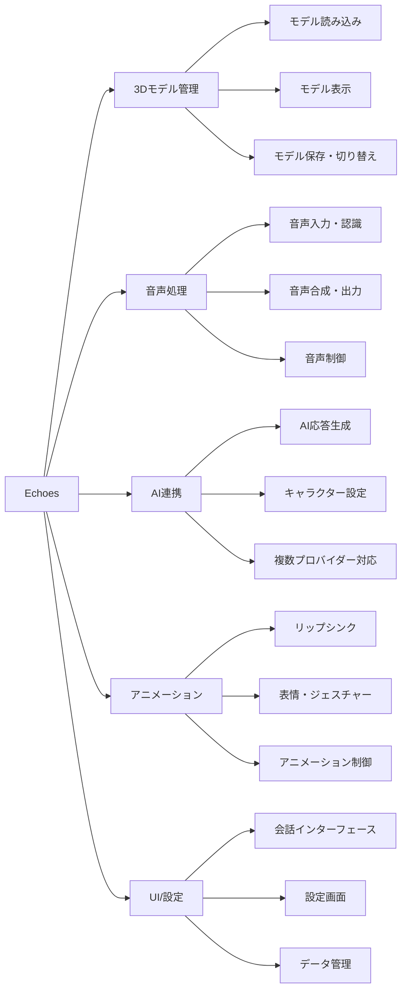
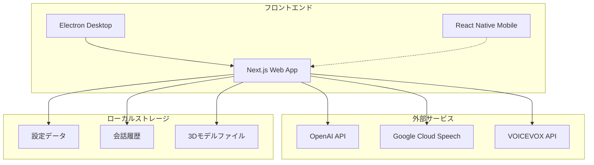
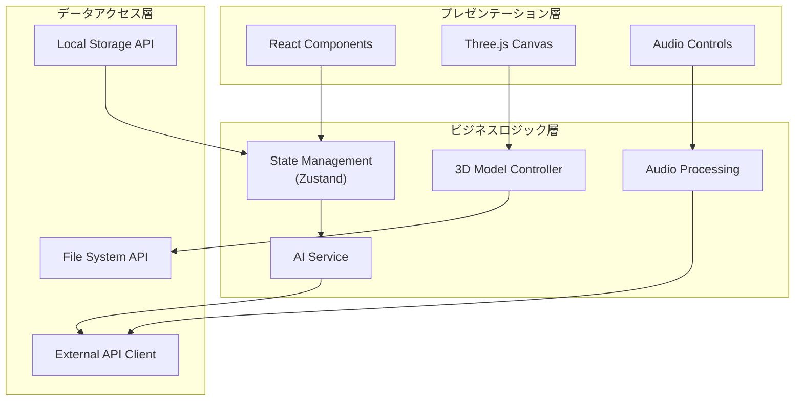
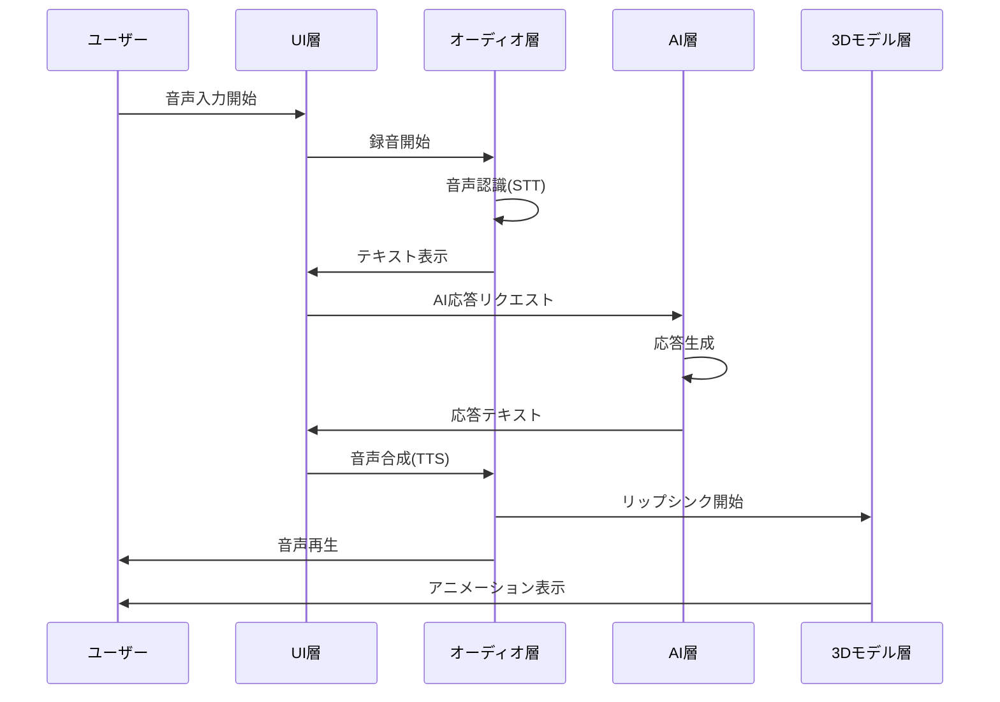
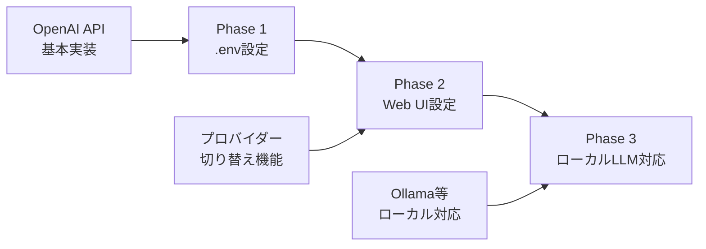
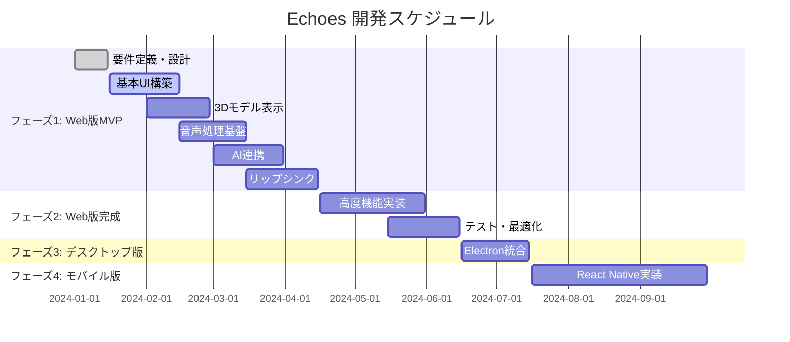
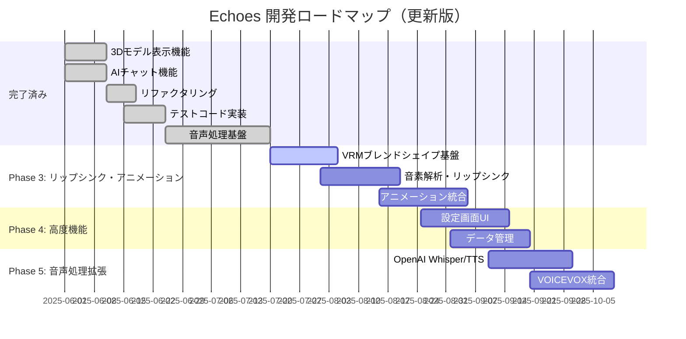

# Echoes 要件定義書

## 1. プロジェクト概要

### 1.1. プロジェクト名

**Echoes（エコーズ）**

### 1.2. プロジェクトの目的・背景

- **目的**: ユーザーが持ち込んだ 3D モデル（アバター）と、AI を介してリアルタイムに音声で会話できるアプリケーションの開発
- **背景**: AI 技術の普及により、よりインタラクティブで親しみやすい AI 体験の需要が高まっている
- **ターゲットユーザー**:
  - VTuber・配信者
  - AI 技術に興味のある一般ユーザー
  - 3D モデル愛好家

### 1.3. プロジェクトスコープ

- **対象プラットフォーム**: Web → デスクトップ → モバイル（段階的展開）
- **開発期間**: 約 7-9 ヶ月
- **開発チーム規模**: 1-3 名想定

## 2. 機能要件

### 2.1. 機能一覧



### 2.2. 詳細機能仕様

#### 2.2.1. 3D モデル管理機能

| 機能 ID | 機能名                 | 詳細                    | 優先度 |
| ------- | ---------------------- | ----------------------- | ------ |
| F1      | モデルファイル読み込み | VRM、glTF、FBX 形式対応 | 高     |
| F2      | モデル表示・操作       | 3D 表示、カメラ操作     | 高     |
| F2-1    | モデル保存・管理       | 複数モデル切り替え      | 中     |

#### 2.2.2. 音声処理機能

| 機能 ID | 機能名        | 詳細                         | 優先度 |
| ------- | ------------- | ---------------------------- | ------ |
| F3      | マイク入力    | デバイス選択、入力レベル表示 | 高     |
| F4      | 音声認識(STT) | リアルタイム日本語認識       | 高     |
| F4-1    | 音声入力制御  | プッシュトゥトーク、VAD      | 中     |
| F6      | 音声合成(TTS) | 日本語対応、声質選択         | 高     |
| F7      | 音声再生      | 基本再生機能                 | 高     |
| F7-1    | 音声出力制御  | 速度・音量調整、一時停止     | 低     |

#### 2.2.3. AI 連携機能

| 機能 ID | 機能名              | 詳細                               | 優先度 |
| ------- | ------------------- | ---------------------------------- | ------ |
| F5      | AI 応答生成         | LLM 連携、応答生成                 | 高     |
| F5-1    | AI 設定カスタマイズ | キャラクター設定、プロバイダー選択 | 中     |

#### 2.2.4. アニメーション機能

| 機能 ID | 機能名             | 詳細                   | 優先度 |
| ------- | ------------------ | ---------------------- | ------ |
| F8      | リップシンク       | 音声同期口パク         | 高     |
| F9      | 表情・ジェスチャー | 感情表現アニメーション | 低     |
| F9-1    | アニメーション制御 | 強度調整、ON/OFF       | 低     |

#### 2.2.5. UI・設定機能

| 機能 ID | 機能名               | 詳細                       | 優先度 |
| ------- | -------------------- | -------------------------- | ------ |
| F10     | 会話インターフェース | チャット画面、会話ログ     | 高     |
| F11     | 設定画面             | 各種設定管理               | 中     |
| F11-1   | データ管理           | 履歴保存、設定エクスポート | 低     |

#### 2.2.6. セキュリティ・システム機能

| 機能 ID | 機能名             | 詳細                     | 優先度 |
| ------- | ------------------ | ------------------------ | ------ |
| F12     | データ保護         | 暗号化、プライバシー保護 | 中     |
| F13     | エラーハンドリング | 例外処理、自動復旧       | 中     |
| F14     | ログ機能           | デバッグログ、問題報告   | 低     |

## 3. 非機能要件

### 3.1. パフォーマンス要件

| 項目           | 要件                                   | 測定方法           |
| -------------- | -------------------------------------- | ------------------ |
| 応答時間       | 音声認識 →AI 応答 → 音声合成: 3 秒以内 | 実測               |
| フレームレート | 3D レンダリング: 30fps 以上            | パフォーマンス監視 |
| メモリ使用量   | 最大 2GB 以内                          | リソース監視       |

### 3.2. 可用性・信頼性要件

| 項目         | 要件                                |
| ------------ | ----------------------------------- |
| 稼働率       | 99%以上（ネットワーク依存部分除く） |
| 障害復旧時間 | 自動復旧: 30 秒以内                 |
| データ保護   | ローカルデータの暗号化保存          |

### 3.3. 互換性要件

| 項目               | 要件                                  |
| ------------------ | ------------------------------------- |
| ブラウザ           | Chrome 90+, Firefox 88+, Safari 14+   |
| OS（デスクトップ） | Windows 10+, macOS 11+, Ubuntu 20.04+ |
| OS（モバイル）     | iOS 14+, Android 10+                  |

## 4. システム構成・アーキテクチャ

### 4.1. システム全体構成



### 4.2. アプリケーション構成



### 4.3. データフロー



## 5. 技術仕様

### 5.1. 開発技術スタック

| 層              | 技術                         | 理由                               |
| --------------- | ---------------------------- | ---------------------------------- |
| フロントエンド  | Next.js + TypeScript         | React 生態系、型安全性             |
| 3D レンダリング | Three.js + React Three Fiber | Web 標準、React 統合               |
| 状態管理        | Zustand                      | 軽量、シンプル                     |
| スタイリング    | Tailwind CSS                 | 高速開発、一貫性                   |
| デスクトップ化  | Electron/Tauri               | Web 技術活用                       |
| モバイル        | React Native + Expo          | コード共有、クロスプラットフォーム |

### 5.2. 外部サービス・API

| サービス       | 用途        | 代替案                              |
| -------------- | ----------- | ----------------------------------- |
| OpenAI API     | AI 応答生成 | Anthropic Claude, ローカル LLM      |
| OpenAI Whisper | 音声認識    | Google Cloud Speech, Web Speech API |
| OpenAI TTS     | 音声合成    | Google Cloud TTS, VOICEVOX          |

### 5.3. AI 実装アプローチ

#### 段階的実装戦略



#### AI プロバイダー設定構造

```typescript
interface AIProviderConfig {
  provider: "openai" | "anthropic" | "local";
  apiKey?: string;
  baseUrl?: string;
  model: string;
  maxTokens?: number;
  temperature?: number;
}

interface AISettings {
  currentProvider: AIProviderConfig;
  providers: {
    openai: AIProviderConfig;
    anthropic: AIProviderConfig;
    local: AIProviderConfig;
  };
}
```

#### 実装優先順位

| フェーズ | 機能                     | 優先度 | 実装方法           |
| -------- | ------------------------ | ------ | ------------------ |
| Phase 1  | OpenAI API 基本実装      | 高     | .env 設定          |
| Phase 2  | Web UI 設定画面          | 中     | 設定コンポーネント |
| Phase 3  | ローカル LLM 対応        | 低     | Ollama 連携        |
| Phase 4  | 複数プロバイダー同時対応 | 低     | 拡張アーキテクチャ |

### 5.4. ディレクトリ構成

```sh
echoes/
├── packages/
│   ├── web/                 # Next.js Webアプリ
│   │   ├── src/
│   │   │   ├── components/  # UIコンポーネント
│   │   │   ├── hooks/       # カスタムフック
│   │   │   ├── services/    # API・ビジネスロジック
│   │   │   ├── stores/      # 状態管理
│   │   │   └── types/       # 型定義
│   │   └── public/          # 静的ファイル
│   ├── desktop/             # Electronアプリ
│   ├── mobile/              # React Nativeアプリ
│   └── shared/              # 共通ライブラリ
├── docs/                    # ドキュメント
└── tools/                   # 開発ツール
```

## 6. 開発計画

### 6.1. 開発フェーズ



### 6.2. マイルストーン

| フェーズ   | 期間     | 主要成果物     | 成功基準               |
| ---------- | -------- | -------------- | ---------------------- |
| フェーズ 1 | 2-3 ヶ月 | Web 版 MVP     | 基本的な会話機能が動作 |
| フェーズ 2 | 1-2 ヶ月 | Web 版完成     | 全機能実装・テスト完了 |
| フェーズ 3 | 1 ヶ月   | デスクトップ版 | Electron での動作確認  |
| フェーズ 4 | 2-3 ヶ月 | モバイル版     | iOS/Android 対応完了   |

## 7. リスク管理

### 7.1. 技術リスク

| リスク                            | 影響度 | 発生確率 | 対策                              |
| --------------------------------- | ------ | -------- | --------------------------------- |
| Three.js でのリップシンク実装困難 | 高     | 中       | 事前 PoC 実施、代替手法検討       |
| Web Speech API の制限             | 中     | 高       | 外部 API 併用、フォールバック実装 |
| モバイル版での 3D 性能問題        | 中     | 中       | 軽量化、LOD 実装                  |

### 7.2. プロジェクトリスク

| リスク              | 影響度 | 発生確率 | 対策                       |
| ------------------- | ------ | -------- | -------------------------- |
| 開発期間の延長      | 中     | 中       | MVP 優先、段階的リリース   |
| 外部 API 費用の増大 | 低     | 低       | 使用量監視、ローカル代替案 |

## 8. 品質保証

### 8.1. テスト戦略

- **単体テスト**: Vitest + Testing Library
- **統合テスト**: Playwright
- **パフォーマンステスト**: Lighthouse, Web Vitals
- **ユーザビリティテスト**: 実ユーザーによる評価

### 8.2. 品質基準

- **コードカバレッジ**: 80%以上
- **パフォーマンススコア**: Lighthouse 90 点以上
- **アクセシビリティ**: WCAG 2.1 AA 準拠

## 9. 次のステップ・実装計画

### 9.1. 現在の実装状況

#### ✅ 完了済み機能

- **3D モデル表示機能**: VRM/glTF/GLB 対応、ドラッグ&ドロップ、カメラ操作
- **AI チャット機能**: OpenAI/Gemini API 対応、プロバイダー切り替え
- **基本 UI**: レスポンシブデザイン、タブ切り替え
- **音声処理基盤**: 音声入力・録音、音声認識(STT)、音声合成(TTS)、プッシュトゥトーク制御

#### 🔄 次の優先実装項目

**SSoT（Single Source of Truth）原則に基づき、詳細な実装計画は GitHub Issue で管理しています。**

##### ✅ Phase 1: コード品質向上・リファクタリング（完了）

- デバッグコード削除、テストコード実装、コード最適化、エラーハンドリング強化

##### ✅ Phase 2: 音声処理基盤（完了）

- 音声入力・録音機能: MediaRecorder API、音声レベル監視
- 音声認識(STT): Web Speech API 統合、リアルタイム認識
- 音声合成(TTS): Web Speech API 統合、音声設定制御
- 音声制御: プッシュトゥトーク、音声チャット統合サービス

##### 🚀 Phase 3: リップシンク・アニメーション（次の実装対象）

**詳細**: [GitHub Issue #13 - Phase 3: リップシンク・アニメーション実装](https://github.com/lvncer/echoes/issues/13)

**Phase 3-1: VRM ブレンドシェイプ基盤**

- VRM ブレンドシェイプアクセス機能の実装
- ブレンドシェイプ制御サービスの作成
- 基本的な表情制御のテスト

**Phase 3-2: 音素解析・リップシンク**

- 音声データから音素抽出機能
- 15 音素対応（sil, aa, ih, ou, E, oh, PP, FF, TH, DD, kk, CH, SS, nn, RR）
- リアルタイム音素解析とブレンドシェイプ制御

**Phase 3-3: アニメーション統合**

- 音声処理サービスとの統合
- AI 応答連動アニメーション
- 感情表現・ジェスチャー制御

##### 📋 Phase 4: 高度機能（予定）

- Web UI 設定画面: カメラ・ライティング・アニメーション詳細設定
- データ管理: 会話履歴保存、設定エクスポート
- パフォーマンス最適化: LOD、キャッシュ、圧縮

##### 📋 Phase 5: 音声処理拡張（予定）

- OpenAI Whisper/TTS API 統合
- VOICEVOX 統合
- 高品質音声処理オプション

### 9.2. 技術的課題と対策

#### リップシンク実装の技術選択

**Phase 3 実装アプローチ**

| 機能                 | 採用技術                       | 理由                           |
| -------------------- | ------------------------------ | ------------------------------ |
| ブレンドシェイプ制御 | @pixiv/three-vrm API           | VRM 標準、Three.js 統合        |
| 音素解析             | Web Audio API + 音素マッピング | ブラウザ標準、リアルタイム処理 |
| リップシンク制御     | カスタム実装                   | 柔軟性、パフォーマンス最適化   |

**VRM ブレンドシェイプ対応音素**

| 音素分類 | 音素                   | 対応する口の形    | 実装優先度 |
| -------- | ---------------------- | ----------------- | ---------- |
| 基本母音 | sil, aa, ih, ou, E, oh | あいうえお + 無音 | 高         |
| 子音     | PP, FF, TH, DD, kk     | 唇・歯音          | 中         |
| 子音     | CH, SS, nn, RR         | 舌音・鼻音        | 中         |

#### パフォーマンス目標（更新）

- **音声認識 →AI 応答 → 音声合成**: 3 秒以内
- **リップシンク応答性**: 100ms 以内
- **3D レンダリング**: 30fps 以上維持（リップシンク含む）
- **メモリ使用量**: 2GB 以内
- **バンドルサイズ**: 600KB 以内（リップシンク機能追加後）

### 9.3. 開発ロードマップ更新



### 9.4. 品質保証計画

#### テスト実装計画（更新）

1. **単体テスト**: 各コンポーネント・サービスの個別テスト
2. **統合テスト**: 3D 表示・AI 連携・音声処理・リップシンクの統合動作テスト
3. **E2E テスト**: ユーザーシナリオベースの完全動作テスト
4. **パフォーマンステスト**: 負荷テスト・メモリリークテスト・リップシンク応答性テスト

#### コード品質基準

- **TypeScript 厳格モード**: strict: true
- **ESLint**: エラー 0、警告最小化
- **Prettier**: コードフォーマット統一
- **コードカバレッジ**: 80%以上

### 9.5. 実装前の確認事項

#### ✅ 確認完了項目

**1. VRM モデル仕様**

- ✅ テスト用 VRM モデル: ニコニ立体ちゃん（ユーザー提供）
- ✅ 基本 5 音素から開始、段階的に 15 音素まで拡張
- ✅ ブレンドシェイプ対応状況: 標準的な VRM ブレンドシェイプ想定

**2. パフォーマンス要件**

- ✅ リップシンク遅延: 250ms 程度（許容済み）
- ✅ フレームレート目標: 30fps 以上維持
- ✅ パフォーマンス重視アプローチ採用

**3. 実装アプローチ**

- ✅ 段階的実装: 音量ベース → 音素解析（承認済み）
- ✅ 音素マッピング方式: 5 音素 → 15 音素
- ✅ Web Audio API 使用、Web Worker 活用

#### 実装準備完了

**技術スタック確定**

- VRM ブレンドシェイプ制御: `@pixiv/three-vrm` API
- 音素解析: Web Audio API `AnalyserNode`
- リップシンク制御: カスタム実装

**テスト環境確定**

- テスト用 VRM モデル: ニコニ立体ちゃん（ユーザー提供）
- 開発環境: 現在のプロジェクト環境
- 追加ライブラリ: 最小限に抑制
