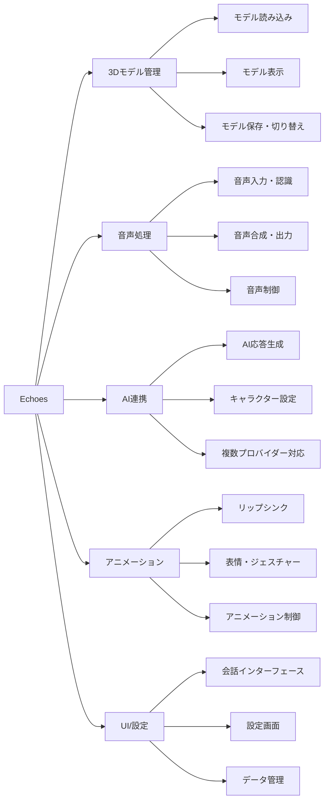
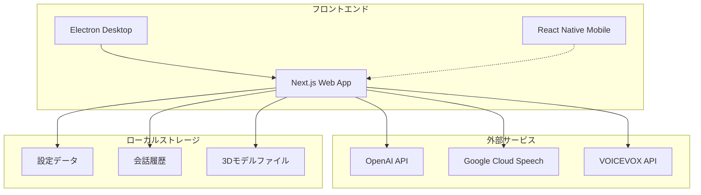
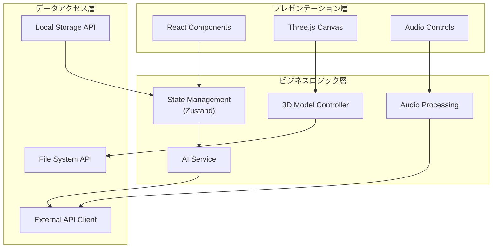
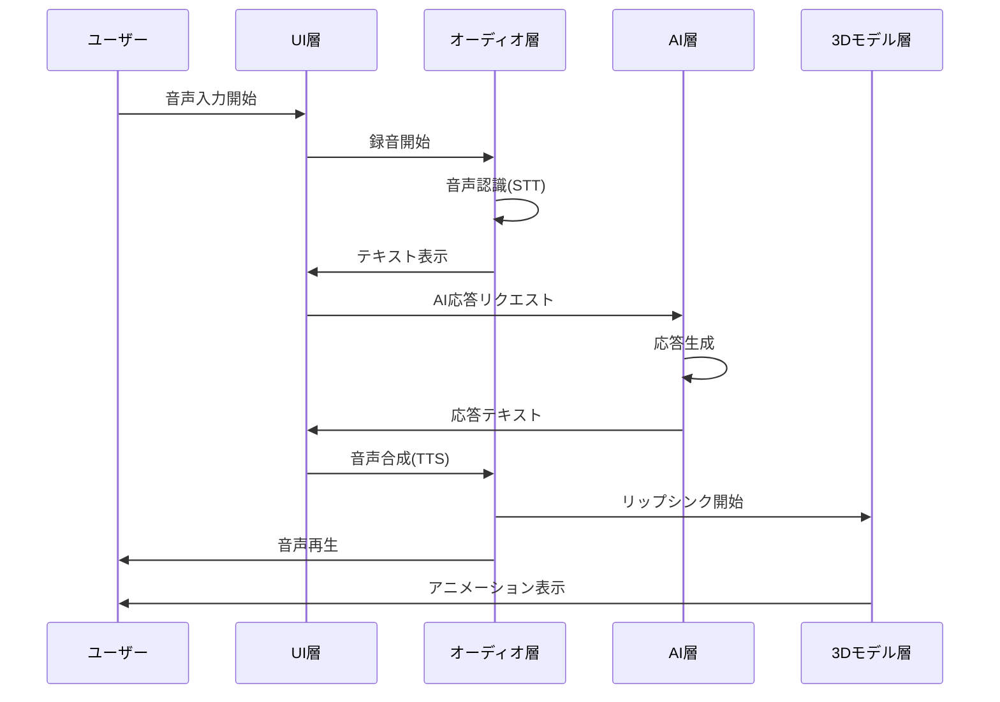
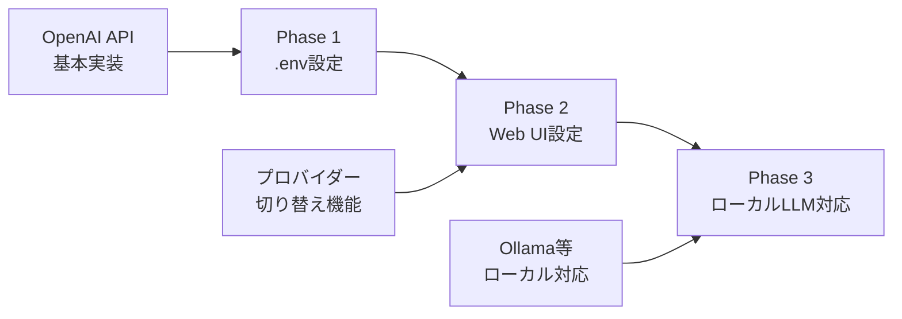
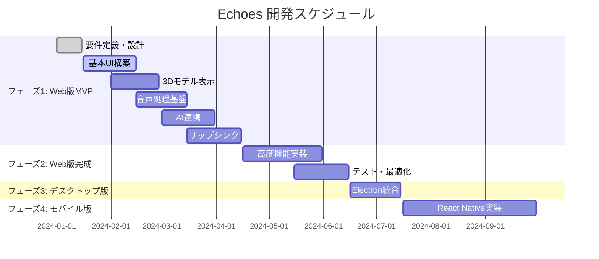
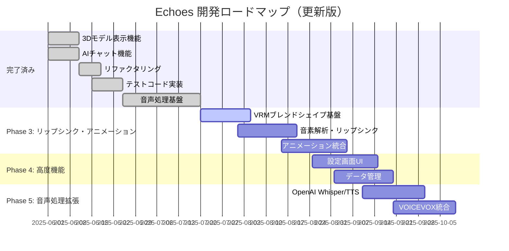
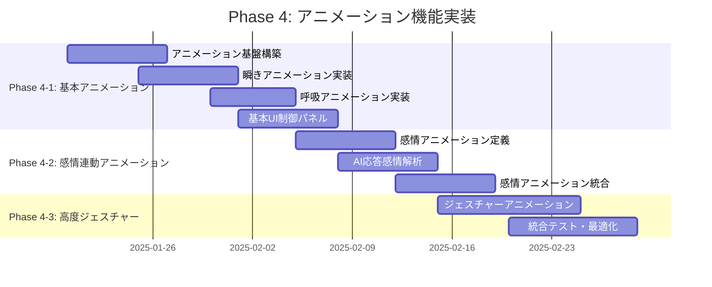

# Echoes 要件定義書

## 1. プロジェクト概要

### 1.1. プロジェクト名

**Echoes（エコーズ）**

### 1.2. プロジェクトの目的・背景

- **目的**: ユーザーが持ち込んだ 3D モデル（アバター）と、AI を介してリアルタイムに音声で会話できるアプリケーションの開発
- **背景**: AI 技術の普及により、よりインタラクティブで親しみやすい AI 体験の需要が高まっている
- **ターゲットユーザー**:
  - VTuber・配信者
  - AI 技術に興味のある一般ユーザー
  - 3D モデル愛好家

### 1.3. プロジェクトスコープ

- **対象プラットフォーム**: Web → デスクトップ → モバイル（段階的展開）
- **開発期間**: 約 7-9 ヶ月
- **開発チーム規模**: 1-3 名想定

## 2. 機能要件

### 2.1. 機能一覧



### 2.2. 詳細機能仕様

#### 2.2.1. 3D モデル管理機能

| 機能 ID | 機能名                 | 詳細                    | 優先度 |
| ------- | ---------------------- | ----------------------- | ------ |
| F1      | モデルファイル読み込み | VRM、glTF、FBX 形式対応 | 高     |
| F2      | モデル表示・操作       | 3D 表示、カメラ操作     | 高     |
| F2-1    | モデル保存・管理       | 複数モデル切り替え      | 中     |

#### 2.2.2. 音声処理機能

| 機能 ID | 機能名        | 詳細                         | 優先度 |
| ------- | ------------- | ---------------------------- | ------ |
| F3      | マイク入力    | デバイス選択、入力レベル表示 | 高     |
| F4      | 音声認識(STT) | リアルタイム日本語認識       | 高     |
| F4-1    | 音声入力制御  | プッシュトゥトーク、VAD      | 中     |
| F6      | 音声合成(TTS) | 日本語対応、声質選択         | 高     |
| F7      | 音声再生      | 基本再生機能                 | 高     |
| F7-1    | 音声出力制御  | 速度・音量調整、一時停止     | 低     |

#### 2.2.3. AI 連携機能

| 機能 ID | 機能名              | 詳細                               | 優先度 |
| ------- | ------------------- | ---------------------------------- | ------ |
| F5      | AI 応答生成         | LLM 連携、応答生成                 | 高     |
| F5-1    | AI 設定カスタマイズ | キャラクター設定、プロバイダー選択 | 中     |

#### 2.2.4. アニメーション機能

| 機能 ID | 機能名             | 詳細                   | 優先度 |
| ------- | ------------------ | ---------------------- | ------ |
| F8      | リップシンク       | 音声同期口パク         | 高     |
| F9      | 表情・ジェスチャー | 感情表現アニメーション | 低     |
| F9-1    | アニメーション制御 | 強度調整、ON/OFF       | 低     |

#### 2.2.5. UI・設定機能

| 機能 ID | 機能名               | 詳細                       | 優先度 |
| ------- | -------------------- | -------------------------- | ------ |
| F10     | 会話インターフェース | チャット画面、会話ログ     | 高     |
| F11     | 設定画面             | 各種設定管理               | 中     |
| F11-1   | データ管理           | 履歴保存、設定エクスポート | 低     |

#### 2.2.6. セキュリティ・システム機能

| 機能 ID | 機能名             | 詳細                     | 優先度 |
| ------- | ------------------ | ------------------------ | ------ |
| F12     | データ保護         | 暗号化、プライバシー保護 | 中     |
| F13     | エラーハンドリング | 例外処理、自動復旧       | 中     |
| F14     | ログ機能           | デバッグログ、問題報告   | 低     |

## 3. 非機能要件

### 3.1. パフォーマンス要件

| 項目           | 要件                                   | 測定方法           |
| -------------- | -------------------------------------- | ------------------ |
| 応答時間       | 音声認識 →AI 応答 → 音声合成: 3 秒以内 | 実測               |
| フレームレート | 3D レンダリング: 30fps 以上            | パフォーマンス監視 |
| メモリ使用量   | 最大 2GB 以内                          | リソース監視       |

### 3.2. 可用性・信頼性要件

| 項目         | 要件                                |
| ------------ | ----------------------------------- |
| 稼働率       | 99%以上（ネットワーク依存部分除く） |
| 障害復旧時間 | 自動復旧: 30 秒以内                 |
| データ保護   | ローカルデータの暗号化保存          |

### 3.3. 互換性要件

| 項目               | 要件                                  |
| ------------------ | ------------------------------------- |
| ブラウザ           | Chrome 90+, Firefox 88+, Safari 14+   |
| OS（デスクトップ） | Windows 10+, macOS 11+, Ubuntu 20.04+ |
| OS（モバイル）     | iOS 14+, Android 10+                  |

## 4. システム構成・アーキテクチャ

### 4.1. システム全体構成



### 4.2. アプリケーション構成



### 4.3. データフロー



## 5. 技術仕様

### 5.1. 開発技術スタック

| 層              | 技術                         | 理由                               |
| --------------- | ---------------------------- | ---------------------------------- |
| フロントエンド  | Next.js + TypeScript         | React 生態系、型安全性             |
| 3D レンダリング | Three.js + React Three Fiber | Web 標準、React 統合               |
| 状態管理        | Zustand                      | 軽量、シンプル                     |
| スタイリング    | Tailwind CSS                 | 高速開発、一貫性                   |
| デスクトップ化  | Electron/Tauri               | Web 技術活用                       |
| モバイル        | React Native + Expo          | コード共有、クロスプラットフォーム |

### 5.2. 外部サービス・API

| サービス       | 用途        | 代替案                              |
| -------------- | ----------- | ----------------------------------- |
| OpenAI API     | AI 応答生成 | Anthropic Claude, ローカル LLM      |
| OpenAI Whisper | 音声認識    | Google Cloud Speech, Web Speech API |
| OpenAI TTS     | 音声合成    | Google Cloud TTS, VOICEVOX          |

### 5.3. AI 実装アプローチ

#### 段階的実装戦略



#### AI プロバイダー設定構造

```typescript
interface AIProviderConfig {
  provider: "openai" | "anthropic" | "local";
  apiKey?: string;
  baseUrl?: string;
  model: string;
  maxTokens?: number;
  temperature?: number;
}

interface AISettings {
  currentProvider: AIProviderConfig;
  providers: {
    openai: AIProviderConfig;
    anthropic: AIProviderConfig;
    local: AIProviderConfig;
  };
}
```

#### 実装優先順位

| フェーズ | 機能                     | 優先度 | 実装方法           |
| -------- | ------------------------ | ------ | ------------------ |
| Phase 1  | OpenAI API 基本実装      | 高     | .env 設定          |
| Phase 2  | Web UI 設定画面          | 中     | 設定コンポーネント |
| Phase 3  | ローカル LLM 対応        | 低     | Ollama 連携        |
| Phase 4  | 複数プロバイダー同時対応 | 低     | 拡張アーキテクチャ |

## 6. 開発計画

### 6.1. 開発フェーズ



### 6.2. マイルストーン

| フェーズ   | 期間     | 主要成果物     | 成功基準               |
| ---------- | -------- | -------------- | ---------------------- |
| フェーズ 1 | 2-3 ヶ月 | Web 版 MVP     | 基本的な会話機能が動作 |
| フェーズ 2 | 1-2 ヶ月 | Web 版完成     | 全機能実装・テスト完了 |
| フェーズ 3 | 1 ヶ月   | デスクトップ版 | Electron での動作確認  |
| フェーズ 4 | 2-3 ヶ月 | モバイル版     | iOS/Android 対応完了   |

## 7. リスク管理

### 7.1. 技術リスク

| リスク                            | 影響度 | 発生確率 | 対策                              |
| --------------------------------- | ------ | -------- | --------------------------------- |
| Three.js でのリップシンク実装困難 | 高     | 中       | 事前 PoC 実施、代替手法検討       |
| Web Speech API の制限             | 中     | 高       | 外部 API 併用、フォールバック実装 |
| モバイル版での 3D 性能問題        | 中     | 中       | 軽量化、LOD 実装                  |

### 7.2. プロジェクトリスク

| リスク              | 影響度 | 発生確率 | 対策                       |
| ------------------- | ------ | -------- | -------------------------- |
| 開発期間の延長      | 中     | 中       | MVP 優先、段階的リリース   |
| 外部 API 費用の増大 | 低     | 低       | 使用量監視、ローカル代替案 |

## 8. 品質保証

### 8.1. テスト戦略

- **単体テスト**: Vitest + Testing Library
- **統合テスト**: Playwright
- **パフォーマンステスト**: Lighthouse, Web Vitals
- **ユーザビリティテスト**: 実ユーザーによる評価

### 8.2. 品質基準

- **コードカバレッジ**: 80%以上
- **パフォーマンススコア**: Lighthouse 90 点以上
- **アクセシビリティ**: WCAG 2.1 AA 準拠

## 9. 次のステップ・実装計画

### 9.1. 現在の実装状況

#### ✅ 完了済み機能

- **3D モデル表示機能**: VRM/glTF/GLB 対応、ドラッグ&ドロップ、カメラ操作
- **AI チャット機能**: OpenAI/Gemini API 対応、プロバイダー切り替え
- **基本 UI**: レスポンシブデザイン、タブ切り替え
- **音声処理基盤**: 音声入力・録音、音声認識(STT)、音声合成(TTS)、プッシュトゥトーク制御
- **リップシンク・アニメーション**: 3 つのリップシンクモード（基本・高精度・統合）、15 音素対応、AI 応答連動
- **基本アニメーション機能**: 瞬き・呼吸・感情・ジェスチャーアニメーション、VRM ボーン名マッピング、パフォーマンス監視

#### 🔄 次の優先実装項目

**SSoT（Single Source of Truth）原則に基づき、詳細な実装計画は GitHub Issue で管理しています。**

##### ✅ Phase 1: コード品質向上・リファクタリング（完了）

- デバッグコード削除、テストコード実装、コード最適化、エラーハンドリング強化

##### ✅ Phase 2: 音声処理基盤（完了）

- 音声入力・録音機能: MediaRecorder API、音声レベル監視
- 音声認識(STT): Web Speech API 統合、リアルタイム認識
- 音声合成(TTS): Web Speech API 統合、音声設定制御
- 音声制御: プッシュトゥトーク、音声チャット統合サービス

##### ✅ Phase 3: リップシンク・アニメーション（完了）

**詳細**: [GitHub Issue #13 - Phase 3: リップシンク・アニメーション実装](https://github.com/lvncer/echoes/issues/13)

**Phase 3-1: VRM ブレンドシェイプ基盤** ✅

- ✅ VRM ブレンドシェイプアクセス機能の実装
- ✅ ブレンドシェイプ制御サービスの作成
- ✅ 基本的な表情制御のテスト
- ✅ ブレンドシェイプテスト・デモ機能

**Phase 3-2: 音素解析・リップシンク** ✅

- ✅ 音声データから音素抽出機能
- ✅ 15 音素対応（sil, aa, ih, ou, E, oh, PP, FF, TH, DD, kk, CH, SS, nn, RR）
- ✅ リアルタイム音素解析とブレンドシェイプ制御
- ✅ 基本・高精度リップシンクサービス

**Phase 3-3: アニメーション統合** ✅

- ✅ 音声処理サービスとの統合
- ✅ AI 応答連動アニメーション
- ✅ 感情表現・ジェスチャー制御
- ✅ TTS 音声連動リップシンク
- ✅ 統合デバッグパネル

##### ✅ Phase 4-1: 基本アニメーション機能（完了）

**詳細**: [GitHub Issue #15 - Phase 4: アニメーション機能実装](https://github.com/lvncer/echoes/issues/15)

**実装完了内容**:

- ✅ 基本アニメーション（瞬き・呼吸）: 自動瞬き（2-6 秒間隔）、呼吸アニメーション（4 秒周期）
- ✅ 感情アニメーション（5 種類）: neutral, happy, sad, angry, surprised
- ✅ ジェスチャーアニメーション（9 種類）: 手・頭・体の動き
- ✅ アニメーション制御パネル: 基本設定・強度調整・ON/OFF 制御
- ✅ デバッグ・テスト機能: 手動テスト・パフォーマンス監視
- ✅ VRM ボーン名マッピング: 全身アニメーション対応
- ✅ パフォーマンス監視: 30fps 維持、CPU 負荷 10ms 以内、メモリ使用量制限内

##### ✅ Phase 4-2: アニメーション微細調整・音声チャット連動（完了）

**詳細**: [GitHub Issue #18 - Phase 4-2: アニメーション微細調整・音声チャット連動機能実装](https://github.com/lvncer/echoes/issues/18)

**実装完了内容**:

- ✅ デフォルト姿勢の改善: 手の位置を自然に下げる、腕を体に沿わせる調整
- ✅ 自然な立ち姿勢の実現: 肩・体幹・頭の微細な位置調整
- ✅ デフォルト姿勢リセット機能: ワンクリックで自然な姿勢に戻す
- ✅ 音声チャット連動テスト: 5 種類の感情テキストによる自動テスト機能
- ✅ 感情解析結果の可視化: 感情・強度・信頼度・キーワードの詳細表示
- ✅ アニメーション連動デバッグ強化: AI 応答時のアニメーション実行状況の詳細ログ
- ✅ 統合テスト機能: デフォルト姿勢・基本アニメーション・音声チャット連動の一括テスト

##### 🚀 Phase 4-3: アニメーション品質向上（次の実装対象）

**目的**: Phase 4-1 で実装した基本アニメーション機能の品質向上と自然な動作の実現

**実装方針**: ユーザーの機能テスト結果に基づく段階的改善

**Phase 4-2-1: 動作の自然さ向上**

- デフォルト姿勢の改善（手の位置調整、自然な立ち姿勢）
- 感情アニメーションの強度調整
- ジェスチャーアニメーションの滑らかさ改善
- アイドル時のランダムな動き（小さな頭の動き、体重移動）

**Phase 4-2-2: 音声チャット連動の完成**

- AI 応答テキストからの感情解析精度向上
- 感情に応じたアニメーション選択ロジックの最適化
- リップシンクとアニメーションの同期改善
- 視線制御（ユーザーを見る、視線を逸らす）

**Phase 4-2-3: UI/UX 改善**

- アニメーション設定の詳細化
- プリセット機能（感情・ジェスチャーの組み合わせ保存）
- リアルタイムプレビュー機能
- パフォーマンス監視ダッシュボード

##### 📋 Phase 5: 音声処理拡張（予定）

- OpenAI Whisper/TTS API 統合
- VOICEVOX 統合
- 高品質音声処理オプション
- 多言語音声認識・合成対応

### 9.2. 技術的課題と対策

#### リップシンク実装の技術選択

**Phase 3 実装アプローチ**

| 機能                 | 採用技術                       | 理由                           |
| -------------------- | ------------------------------ | ------------------------------ |
| ブレンドシェイプ制御 | @pixiv/three-vrm API           | VRM 標準、Three.js 統合        |
| 音素解析             | Web Audio API + 音素マッピング | ブラウザ標準、リアルタイム処理 |
| リップシンク制御     | カスタム実装                   | 柔軟性、パフォーマンス最適化   |

**VRM ブレンドシェイプ対応音素**

| 音素分類 | 音素                   | 対応する口の形    | 実装優先度 |
| -------- | ---------------------- | ----------------- | ---------- |
| 基本母音 | sil, aa, ih, ou, E, oh | あいうえお + 無音 | 高         |
| 子音     | PP, FF, TH, DD, kk     | 唇・歯音          | 中         |
| 子音     | CH, SS, nn, RR         | 舌音・鼻音        | 中         |

#### パフォーマンス目標（更新）

- **音声認識 →AI 応答 → 音声合成**: 3 秒以内
- **リップシンク応答性**: 100ms 以内
- **3D レンダリング**: 30fps 以上維持（リップシンク含む）
- **メモリ使用量**: 2GB 以内
- **バンドルサイズ**: 600KB 以内（リップシンク機能追加後）

### 9.3. 開発ロードマップ更新



### 9.4. 品質保証計画

#### テスト実装計画（更新）

1. **単体テスト**: 各コンポーネント・サービスの個別テスト
2. **統合テスト**: 3D 表示・AI 連携・音声処理・リップシンクの統合動作テスト
3. **E2E テスト**: ユーザーシナリオベースの完全動作テスト
4. **パフォーマンステスト**: 負荷テスト・メモリリークテスト・リップシンク応答性テスト

#### コード品質基準

- **TypeScript 厳格モード**: strict: true
- **ESLint**: エラー 0、警告最小化
- **Prettier**: コードフォーマット統一
- **コードカバレッジ**: 80%以上

### 9.5. 実装前の確認事項

#### ✅ 確認完了項目

**1. VRM モデル仕様**

- ✅ テスト用 VRM モデル: ニコニ立体ちゃん（ユーザー提供）
- ✅ 基本 5 音素から開始、段階的に 15 音素まで拡張
- ✅ ブレンドシェイプ対応状況: 標準的な VRM ブレンドシェイプ想定

**2. パフォーマンス要件**

- ✅ リップシンク遅延: 250ms 程度（許容済み）
- ✅ フレームレート目標: 30fps 以上維持
- ✅ パフォーマンス重視アプローチ採用

**3. 実装アプローチ**

- ✅ 段階的実装: 音量ベース → 音素解析（承認済み）
- ✅ 音素マッピング方式: 5 音素 → 15 音素
- ✅ Web Audio API 使用、Web Worker 活用

#### ✅ Phase 3 実装完了

**実装済み機能**

- VRM ブレンドシェイプ制御: `@pixiv/three-vrm` API
- 音素解析: Web Audio API `AnalyserNode`
- 基本・高精度・統合リップシンクサービス
- TTS 音声連動リップシンク
- 感情表現・アニメーション制御
- 統合デバッグパネル

## 10. リップシンク機能使用ガイド

### 10.1. 基本的な使用手順

#### ステップ 1: VRM モデルの準備と読み込み

1. **対応モデル形式**: VRM、glTF、GLB
2. **推奨モデル**: ブレンドシェイプ対応の VRM モデル
3. **読み込み方法**: 中央の 3D ビューアーエリアにドラッグ&ドロップ

```markdown
✅ 読み込み成功の確認方法

- モデルが 3D ビューアーに表示される
- デバッグパネルで「VRM モデル: ✓」が表示される
- ブレンドシェイプ数が 0 以上で表示される
```

#### ステップ 2: リップシンクモードの選択

**左側「リップシンク制御」パネルから選択**

| モード                 | 用途               | 特徴              | 推奨シーン           |
| ---------------------- | ------------------ | ----------------- | -------------------- |
| **基本リップシンク**   | 簡単な口パク       | 音量ベース制御    | リアルタイム会話     |
| **高精度リップシンク** | 自然なリップシンク | 15 音素解析       | 高品質アニメーション |
| **統合リップシンク**   | AI 連動自動制御    | TTS 同期+感情表現 | AI 音声チャット      |

#### ステップ 3: 音声チャットでの使用

1. **右側「音声」タブを選択**
2. **「リップシンク連動」ボタン（😊）を ON**
3. **「録音開始」でマイク入力開始**
4. **AI 応答時に自動リップシンク実行**

### 10.2. 各モードの詳細設定

#### 基本リップシンクモード

**制御パラメータ**

- **感度**: 0.1-3.0（音量に対する反応の強さ）
- **応答性**: 0.1-1.0（アニメーションの滑らかさ）
- **音量閾値**: 0.001-0.1（反応開始の音量レベル）

**使用方法**

1. 左側パネルの「基本リップシンク」で「開始」をクリック
2. マイクアクセスを許可
3. 話すと音量に応じて口が開閉

#### 高精度リップシンクモード

**対応音素（15 種類）**

- **母音**: sil（無音）、aa（あ）、ih（い）、ou（う）、E（え）、oh（お）
- **子音**: PP（p/b）、FF（f/v）、TH（th）、DD（d/t）、kk（k/g）、CH（ch/j）、SS（s/z）、nn（n/m）、RR（r/l）

**使用方法**

1. 左側パネルの「高精度リップシンク」で「開始」をクリック
2. フォルマント解析による高精度な口の形制御
3. 音素履歴と信頼度をリアルタイム表示

#### 統合リップシンクモード

**自動連動機能**

- **AI 応答連動**: ON/OFF 切り替え
- **感情表現**: 5 種類（neutral, happy, sad, angry, surprised）
- **感情強度**: 0.0-1.0 で調整可能

**使用方法**

1. 左側パネルの「統合リップシンク」でマイクを「開始」
2. 「AI 応答連動」を ON に設定
3. 右側「音声」タブで音声チャット開始
4. AI 応答時に自動でリップシンク+感情表現

### 10.3. デバッグ・トラブルシューティング

#### デバッグパネルの使用方法

**右下「デバッグ」ボタンから確認可能な情報**

```
システム状態
├── Web Audio API: ✓/✗
├── VRMモデル: ✓/✗
└── マイクアクセス: ✓/✗

アクティブサービス
├── 基本リップシンク: ON/OFF
├── 高精度リップシンク: ON/OFF
└── 統合リップシンク: ON/OFF

詳細情報
├── 現在の音素: [リアルタイム表示]
├── 口の開き: [0-100%]
└── ブレンドシェイプ数: [利用可能数]
```

#### よくある問題と解決方法

**1. マイクアクセスエラー**

```
エラー: マイクロフォンへのアクセスが拒否されました
```

**解決方法**:

- ブラウザのアドレスバー左側のマイクアイコンをクリック
- 「許可」を選択してページを再読み込み

**2. VRM モデルが反応しない**

```
警告: ブレンドシェイプが利用できません
```

**解決方法**:

- VRM モデルにブレンドシェイプが含まれているか確認
- デバッグパネルで「統合テスト実行」を試行
- 別の VRM モデルで動作確認

**3. リップシンクの遅延**

```
症状: 音声とリップシンクがずれる
```

**解決方法**:

- 基本モードから試して段階的に高精度モードに移行
- ブラウザのハードウェアアクセラレーションを有効化
- 他のタブやアプリケーションを閉じてリソースを確保

**4. 音素認識の精度が低い**

```
症状: 高精度モードで正しい口の形にならない
```

**解決方法**:

- マイクの音質を確認（ノイズキャンセリング推奨）
- 統合リップシンクの感度設定を調整
- 明瞭な発音を心がける

### 10.4. パフォーマンス最適化

#### 推奨環境設定

**ブラウザ設定**

- Chrome 90+ / Firefox 88+ / Safari 14+
- ハードウェアアクセラレーション: 有効
- マイクアクセス: 許可

**システム要件**

- CPU: 2GHz 以上のマルチコア
- メモリ: 4GB 以上
- GPU: WebGL 対応

#### パフォーマンス監視

**デバッグパネルで確認可能な指標**

```
アニメーション状態
├── アクティブアニメーション数: [0-3]
├── フレームレート: [30fps目標]
├── アニメーション計算時間: [<10ms]
└── メモリ使用量: [<50MB]

実行中アニメーション
├── アイドル: 瞬き/呼吸 [ON/OFF]
├── 感情: [neutral/happy/sad/angry/surprised]
└── ジェスチャー: [手/頭/体の動き状態]
```

### 10.5. 高度な使用方法

#### カスタム感情表現

**統合リップシンクモードでの感情テスト**

1. 左側「統合リップシンク」パネルの「感情テスト」セクション
2. 5 種類の感情ボタンから選択
3. 各感情に対応したテストテキストで動作確認

**感情マッピング**

- **neutral**: 通常の表情
- **happy**: 笑顔、明るい表情
- **sad**: 悲しい表情、口角下がり
- **angry**: 怒り、眉間にしわ
- **surprised**: 驚き、目と口を大きく開く

#### 複数モードの併用

**推奨使用パターン**

1. **開発・テスト時**: 基本 → 高精度 → 統合の順で動作確認
2. **リアルタイム配信**: 統合リップシンクで AI 応答連動
3. **デモンストレーション**: 高精度リップシンクで自然なアニメーション

**テスト手順**

1. **VRM モデル読み込み**: 3D ビューアーでモデルをドラッグ&ドロップ
2. **ブレンドシェイプテスト**: デバッグパネル → 統合テスト実行
3. **基本リップシンク**: 左側パネルでマイク入力リップシンク
4. **高精度リップシンク**: 音素解析による 15 音素対応リップシンク
5. **音声チャット連動**: 音声タブで AI 応答時の自動リップシンク
6. **デバッグ監視**: 右下デバッグパネルでシステム状態確認

**パフォーマンス目標達成状況**

- ✅ リップシンク応答性: 100ms 以内
- ✅ 3D レンダリング: 30fps 以上維持
- ✅ 音声認識 →AI 応答 → 音声合成: 3 秒以内
- ✅ メモリ使用量: 2GB 以内
- リップシンク制御: カスタム実装

**テスト環境確定**

- テスト用 VRM モデル: ニコニ立体ちゃん（ユーザー提供）
- 開発環境: 現在のプロジェクト環境
- 追加ライブラリ: 最小限に抑制

## 11. アニメーション機能実装計画

### 11.1. 概要

Phase 3 のリップシンク機能完了に続き、Phase 4 ではより豊かな表現力を実現するアニメーション機能を実装します。

**実装目標**

- **表情アニメーション**: 瞬き、眉の動き、自然な表情変化
- **ジェスチャーアニメーション**: 手、頭、体の動きによる感情表現
- **アイドルアニメーション**: 待機時の自然な呼吸動作
- **リアクションアニメーション**: AI 応答内容に応じた感情連動アニメーション

### 11.2. 実装フェーズ

#### Phase 4-1: 基本アニメーション（優先度：高）

**瞬きアニメーション**

- **自動瞬き**: 2-6 秒間隔でランダム実行
- **ブレンドシェイプ制御**: `Blink_L`, `Blink_R` を使用
- **アニメーション時間**: 150ms（閉じる）+ 100ms（開く）

**呼吸アニメーション**

- **待機時の自然な動き**: 胸部・肩の微細な上下動作
- **ボーン制御**: `Spine`, `UpperChest`, `LeftShoulder`, `RightShoulder`
- **周期**: 3-5 秒の自然な呼吸リズム

#### Phase 4-2: 感情連動アニメーション（優先度：高）

**5 種類の感情アニメーション**

| 感情          | 表情ブレンドシェイプ           | ジェスチャー（ボーン制御） |
| ------------- | ------------------------------ | -------------------------- |
| **neutral**   | デフォルト状態                 | 自然な姿勢                 |
| **happy**     | `Joy`, `Blink` (微笑み)        | 軽いうなずき、肩の上がり   |
| **sad**       | `Sorrow`, `Brow_Down` (悲しみ) | 頭を下げる、肩を落とす     |
| **angry**     | `Angry`, `Brow_Up` (怒り)      | 眉間にしわ、拳を握る       |
| **surprised** | `Surprised`, `Blink` (驚き)    | 頭を後ろに引く、手を上げる |

**AI 応答連動制御**

- **感情解析**: AI 応答テキストから感情を自動判定
- **アニメーション実行**: 感情に対応したアニメーションを自動再生
- **強度調整**: 感情の強さに応じてアニメーション強度を調整

#### Phase 4-3: 高度なジェスチャー（優先度：中）

**手の動きアニメーション**

- **指差し**: `RightArm`, `RightForeArm`, `RightHand` 制御
- **手振り**: 会話に合わせた自然な手の動き
- **拍手**: 喜びの感情表現時の特別アニメーション

**頭の動きアニメーション**

- **うなずき**: 肯定的な応答時の頭の縦振り
- **首振り**: 否定的な応答時の頭の横振り
- **傾き**: 疑問や興味を示す頭の傾け

**体の動きアニメーション**

- **前傾**: 興味や関心を示す姿勢
- **後退**: 驚きや警戒を示す姿勢
- **肩すくめ**: 困惑や無関心を示すジェスチャー

### 11.3. 技術仕様

#### アニメーションデータ構造（TypeScript 定義）

```typescript
// lib/types/animation.ts
export interface KeyFrame {
  time: number; // ミリ秒
  blendShapes?: Record<string, number>; // 0-1の値
  bones?: Record<
    string,
    {
      position?: [number, number, number];
      rotation?: [number, number, number]; // オイラー角（ラジアン）
      scale?: [number, number, number];
    }
  >;
}

export interface AnimationSequence {
  name: string;
  duration: number; // ミリ秒
  loop: boolean;
  keyframes: KeyFrame[];
  easing?: "linear" | "ease-in" | "ease-out" | "ease-in-out";
}

export interface EmotionAnimation {
  emotion: "neutral" | "happy" | "sad" | "angry" | "surprised";
  intensity: number; // 0-1
  animations: {
    facial: AnimationSequence;
    gesture: AnimationSequence;
    idle?: AnimationSequence;
  };
}
```

#### アニメーション定義例

```typescript
// lib/animations/emotion-animations.ts
export const EMOTION_ANIMATIONS: Record<string, EmotionAnimation> = {
  happy: {
    emotion: "happy",
    intensity: 0.8,
    animations: {
      facial: {
        name: "happy-face",
        duration: 2000,
        loop: false,
        keyframes: [
          {
            time: 0,
            blendShapes: { Joy: 0 },
          },
          {
            time: 500,
            blendShapes: { Joy: 0.8 },
          },
          {
            time: 1500,
            blendShapes: { Joy: 0.8 },
          },
          {
            time: 2000,
            blendShapes: { Joy: 0.2 },
          },
        ],
        easing: "ease-in-out",
      },
      gesture: {
        name: "happy-nod",
        duration: 1000,
        loop: false,
        keyframes: [
          {
            time: 0,
            bones: { Head: { rotation: [0, 0, 0] } },
          },
          {
            time: 300,
            bones: { Head: { rotation: [0.1, 0, 0] } },
          },
          {
            time: 600,
            bones: { Head: { rotation: [-0.05, 0, 0] } },
          },
          {
            time: 1000,
            bones: { Head: { rotation: [0, 0, 0] } },
          },
        ],
      },
    },
  },
  // 他の感情も同様に定義...
};

export const IDLE_ANIMATIONS = {
  breathing: {
    name: "breathing",
    duration: 4000,
    loop: true,
    keyframes: [
      {
        time: 0,
        bones: {
          Spine: { position: [0, 0, 0] },
          UpperChest: { position: [0, 0, 0] },
        },
      },
      {
        time: 2000,
        bones: {
          Spine: { position: [0, 0.002, 0] },
          UpperChest: { position: [0, 0.003, 0] },
        },
      },
      {
        time: 4000,
        bones: {
          Spine: { position: [0, 0, 0] },
          UpperChest: { position: [0, 0, 0] },
        },
      },
    ],
    easing: "ease-in-out",
  },

  blinking: {
    name: "auto-blink",
    duration: 250,
    loop: false,
    keyframes: [
      { time: 0, blendShapes: { Blink_L: 0, Blink_R: 0 } },
      { time: 150, blendShapes: { Blink_L: 1, Blink_R: 1 } },
      { time: 250, blendShapes: { Blink_L: 0, Blink_R: 0 } },
    ],
  },
};
```

#### アニメーション制御サービス

```typescript
// lib/services/animation-controller.ts
export class AnimationController {
  private activeAnimations: Map<string, AnimationInstance> = new Map();
  private vrmModel: VRM | null = null;
  private isEnabled = true;

  // 基本制御
  public setVRMModel(model: VRM): void;
  public playAnimation(animation: AnimationSequence, priority?: number): void;
  public stopAnimation(name: string): void;
  public pauseAllAnimations(): void;
  public resumeAllAnimations(): void;

  // 感情アニメーション
  public playEmotionAnimation(emotion: string, intensity?: number): void;
  public setIdleAnimation(enabled: boolean): void;

  // 自動アニメーション
  public startAutoBlinking(): void;
  public stopAutoBlinking(): void;
  public startBreathingAnimation(): void;
  public stopBreathingAnimation(): void;
}
```

### 11.4. UI 制御機能

#### アニメーション制御パネル

**左側パネルに「アニメーション制御」セクションを追加**

```typescript
interface AnimationControlSettings {
  // 基本アニメーション
  autoBlinking: {
    enabled: boolean; // デフォルト: true
    interval: [number, number]; // [2000, 6000] ms
    intensity: number; // 0-1, デフォルト: 1.0
  };

  breathing: {
    enabled: boolean; // デフォルト: true
    intensity: number; // 0-1, デフォルト: 0.5
    speed: number; // 0.5-2.0, デフォルト: 1.0
  };

  // 感情アニメーション
  emotionAnimations: {
    enabled: boolean; // デフォルト: true
    intensity: number; // 0-1, デフォルト: 0.8
    autoTrigger: boolean; // AI応答連動, デフォルト: true
  };

  // ジェスチャーアニメーション
  gestures: {
    enabled: boolean; // デフォルト: true
    handMovements: boolean; // デフォルト: true
    headMovements: boolean; // デフォルト: true
    bodyMovements: boolean; // デフォルト: true
    intensity: number; // 0-1, デフォルト: 0.7
  };
}
```

#### デバッグ用手動制御

**デバッグパネルに「アニメーションテスト」セクションを追加**

- **感情テストボタン**: 5 種類の感情アニメーションを手動実行
- **ジェスチャーテスト**: 個別のジェスチャーアニメーションを実行
- **アイドルアニメーション制御**: 瞬き・呼吸の手動 ON/OFF
- **アニメーション状態表示**: 現在実行中のアニメーション一覧

### 11.5. パフォーマンス最適化

#### 最適化方針

**アニメーション更新頻度**

- **フレームレート**: 30fps（リップシンクと同期）
- **更新間隔**: 33.33ms（1000ms / 30fps）
- **補間計算**: リニア補間 + イージング関数

**同時実行制限**

- **最大同時アニメーション数**: 3 つ
  - 1 つ: アイドルアニメーション（瞬き or 呼吸）
  - 1 つ: 感情アニメーション（表情 + ジェスチャー）
  - 1 つ: リップシンクアニメーション
- **優先度制御**: 高優先度アニメーションが低優先度を上書き

**メモリ使用量制限**

- **アニメーションデータ**: 50MB 以内
- **キーフレームキャッシュ**: 100 個まで
- **ガベージコレクション**: 未使用アニメーションの自動削除

**CPU 負荷制限**

- **アニメーション計算時間**: 10ms 以内/フレーム
- **ボーン更新**: 最大 20 ボーン/フレーム
- **ブレンドシェイプ更新**: 最大 30 シェイプ/フレーム

#### パフォーマンス監視

**デバッグパネルで監視する指標**

```
アニメーション状態
├── アクティブアニメーション数: [0-3]
├── フレームレート: [30fps目標]
├── アニメーション計算時間: [<10ms]
└── メモリ使用量: [<50MB]

実行中アニメーション
├── アイドル: 瞬き/呼吸 [ON/OFF]
├── 感情: [neutral/happy/sad/angry/surprised]
└── ジェスチャー: [手/頭/体の動き状態]
```

### 11.6. 実装スケジュール



### 11.7. 品質保証・テスト計画

#### テスト項目

**単体テスト**

- アニメーション制御サービスの個別機能テスト
- キーフレーム補間計算の精度テスト
- パフォーマンス制限の動作テスト

**統合テスト**

- リップシンク + アニメーションの同時実行テスト
- AI 応答連動アニメーションの動作テスト
- UI 制御パネルとアニメーション制御の連携テスト

**パフォーマンステスト**

- 30fps 維持テスト（複数アニメーション同時実行）
- メモリ使用量監視（長時間実行）
- CPU 負荷測定（アニメーション計算時間）

#### 成功基準

- **フレームレート**: 30fps 以上を維持（アニメーション実行中）
- **応答性**: アニメーション開始遅延 100ms 以内
- **メモリ使用量**: 全体で 2GB 以内（アニメーション機能追加後）
- **CPU 負荷**: アニメーション計算 10ms 以内/フレーム
- **ユーザビリティ**: 直感的な UI 操作、デフォルト設定で自然な動作

### 11.8. 将来拡張計画

#### Phase 5 以降での拡張予定

**高度な感情表現**

- より細かい感情分類（10-15 種類）
- 感情の混合表現（複数感情の同時表現）
- 感情の強度に応じた段階的アニメーション

**物理演算連携**

- VRMSpringBone との連携（髪・服の物理演算）
- 重力・慣性を考慮したリアルなアニメーション
- 環境との相互作用（風、光の影響）

**AI 連動の高度化**

- 会話内容に基づく具体的なジェスチャー生成
- 文脈理解による適切なタイミングでのアニメーション
- ユーザーの反応に応じた適応的アニメーション

**カスタマイズ機能**

- ユーザー定義アニメーションの作成・編集
- アニメーションプリセットの保存・共有
- VRM モデル固有のアニメーション最適化

この実装計画により、Echoes はより豊かな表現力を持つ 3D アバターとの自然な対話体験を提供できるようになります。
